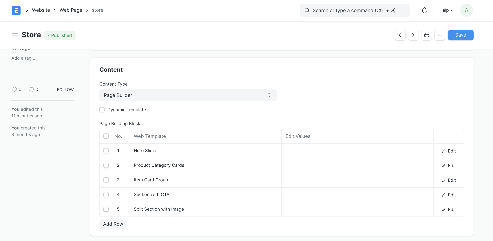

# Frappe Webshop

A modern, feature-rich Open Source eCommerce platform built on the Frappe Framework with seamless ERPNext integration. Designed for small to medium-sized businesses to create tailored online stores with powerful backend management and beautiful, responsive frontend.

[](LICENSE)

## Key Features

### Product Management

- **Advanced Product Catalog**: Create and manage products with variants, attributes, and detailed specifications
- **Variant Management**: Full support for product variants with variant-specific images
- **Inventory Control**: Real-time stock tracking integrated with ERPNext
- **Product Images**: Multiple image support with variant-specific image galleries
- **Product Reviews & Ratings**: Customer feedback and rating system
- **Product Recommendations**: Cross-sell and upsell capabilities

### Shopping Experience

- **Shopping Cart**: Feature-rich cart with real-time updates
- **Wishlist**: Save products for later
- **Advanced Search & Filters**: Powerful search with faceted filtering
- **Product Variants Selector**: Dynamic variant selection with attribute-based filtering
- **Coupon System**: Support for discount codes and promotional offers
- **Service Fees**: Dynamic service charges based on payment methods

### Payment & Checkout

- **Dynamic Payment Methods**: Flexible payment method configuration
  - Payment Gateway integration (Xendit, Midtrans, etc.)
  - Manual transfer with admin approval workflow
  - Payment channel selection (e.g., different bank virtual accounts)
- **Payment Request Workflow**: Built-in approval system for manual payments with proof upload
- **Service Fee Calculation**: Automatic service charges based on selected payment method
- **Secure Checkout**: Multi-step checkout process with validation

### Order Management

- **Order Tracking**: Real-time order status updates
- **Return Management**: Complete return request workflow with admin approval
- **Subscription Orders**: Support for recurring subscription products
- **Delivery Scheduling**: Delivery date selection during checkout
- **Order History**: Customer portal with full order history

### Customer Features

- **User Accounts**: Customer registration and profile management
- **Student Management**: Special handling for educational institutions with student profiles
- **Multi-Portal Support**: Student and regular customer portals
- **Address Management**: Multiple shipping/billing addresses
- **Order Notifications**: Email and system notifications

### Frontend Technology Stack

- **Vue 3**: Modern reactive framework with Composition API
- **TypeScript**: Type-safe development
- **Vite**: Lightning-fast build tool
- **Pinia**: State management
- **Vue Router**: Client-side routing
- **Tailwind CSS**: Utility-first styling framework
- **Frappe UI**: Component library for consistent design

### Backend Architecture

- **Frappe Framework**: Robust backend framework
- **ERPNext Integration**: Full integration with ERPNext modules
  - Items & Pricing
  - Quotations & Sales Orders
  - Inventory Management
  - Payment Entries
  - Delivery Notes & Sales Invoices
- **RESTful APIs**: Well-documented API endpoints
- **Real-time Updates**: WebSocket support for live updates
- **Caching**: Redis-based caching for performance optimization
- **Background Jobs**: Asynchronous task processing

### Additional Features

- **Responsive Design**: Mobile-first, works on all devices
- **Homepage Customization**: Configurable banners, featured products, and offers
- **Item Groups**: Hierarchical product categorization
- **Tax Rules**: Dynamic tax calculation based on customer location
- **Multi-currency**: Support for different currencies
- **SEO Optimized**: Meta tags and structured data support

## Table of Contents

- [Why Choose Frappe Webshop?](#why-choose-frappe-webshop)
- [Screenshots](#screenshots)
- [Tech Stack](#tech-stack)
- [Prerequisites](#prerequisites)
- [Installation](#installation)
  - [Using Docker (Recommended)](#using-docker-recommended)
  - [Easy Install Script](#easy-install-script)
  - [Manual Installation](#manual-installation)
- [Configuration](#configuration)
- [Development](#development)
  - [Backend Development](#backend-development)
  - [Frontend Development](#frontend-development)
- [Documentation](#documentation)
- [API Reference](#api-reference)
- [Testing](#testing)
- [Contributing](#contributing)
- [License](#license)

## Why Choose Frappe Webshop?

### Fast & Efficient

Streamlined online sales process with modern frontend technology offering lightning-fast page loads and smooth user experience.

### Highly Customizable

Every aspect is customizable - from payment methods to product attributes, from homepage layout to checkout flow. No code changes needed for most configurations.

### ERPNext Integration

Seamless integration with ERPNext means your eCommerce data flows directly into your ERP system:

- Inventory syncs automatically
- Orders become Sales Orders
- Payments are recorded as Payment Entries
- Returns create Credit Notes
- Complete accounting integration

### Developer Friendly

- Modern tech stack (Vue 3, TypeScript, Vite)
- Well-documented APIs
- Clean code architecture
- Extensive hooks system
- Component-based frontend

### Self-Hosted & Secure

- Complete data ownership
- No transaction fees
- Full control over customizations
- Enterprise-grade security

### Open Source & Free

- No licensing fees
- Active community
- Regular updates
- Extensible architecture

## Screenshots



## Tech Stack

### Frontend

- **Framework**: Vue 3 with TypeScript
- **Build Tool**: Vite
- **State Management**: Pinia
- **Routing**: Vue Router
- **Styling**: Tailwind CSS
- **UI Components**: Frappe UI
- **HTTP Client**: Axios (via Frappe UI)

### Backend

- **Framework**: Frappe
- **Language**: Python 3.10+
- **Database**: MariaDB
- **Cache**: Redis
- **Task Queue**: RQ (Redis Queue)
- **ERP**: ERPNext

## Prerequisites

- Python 3.10 or higher
- Node.js 20.19.0+ or 22.12.0+
- MariaDB 10.6+
- Redis 6.0+
- ERPNext (version compatible with your Frappe version)

## Installation

### Using Docker (Recommended)

The easiest way to get started is using Frappe Docker:

```bash
# Clone frappe_docker repository
git clone https://github.com/frappe/frappe_docker.git
cd frappe_docker

# Follow the setup instructions in frappe_docker repository
# After setting up Frappe and ERPNext, add webshop app:

# Get the webshop app
bench get-app https://github.com/Irfan234-afif/webshop.git

# Install on your site
bench --site your-site-name install-app webshop
```

For detailed Docker setup instructions, see: [Frappe Docker Documentation](https://github.com/frappe/frappe_docker)

### Easy Install Script

For production installations on a fresh Ubuntu/Debian server:

```bash
# Download the easy install script
wget https://raw.githubusercontent.com/frappe/bench/develop/easy-install.py

# Run the installation
sudo python3 easy-install.py --prod --email your@email.com

# After installation completes:
cd frappe-bench

# Get webshop app
bench get-app https://github.com/Irfan234-afif/webshop.git

# Install on your site
bench --site your-site-name install-app webshop
```

### Manual Installation

For local development:

```bash
# Install bench
pip install frappe-bench

# Initialize a new bench
bench init frappe-bench --frappe-branch version-15
cd frappe-bench

# Create a new site
bench new-site your-site-name

# Get ERPNext (required dependency)
bench get-app erpnext --branch version-15
bench --site your-site-name install-app erpnext

# Get payments app (required dependency)
bench get-app payments
bench --site your-site-name install-app payments

# Get webshop app
bench get-app https://github.com/Irfan234-afif/webshop.git
bench --site your-site-name install-app webshop

# Start development server
bench start
```

For more bench commands and usage: [Bench Documentation](https://github.com/frappe/bench)

## Configuration

### Initial Setup

1. **Access Webshop Settings**
   - Navigate to: `Webshop > Settings > Webshop Settings`
2. **Configure Basic Settings**

   - Company: Select your ERPNext company
   - Default Warehouse: Set the warehouse for webshop inventory
   - Price List: Configure default price list
   - Currency: Set default currency

3. **Setup Payment Methods**

   - Navigate to: `Webshop > Payment > Webshop Payment Method`
   - Create payment methods:
     - **Transfer Manual**: Bank transfers with/without admin approval
     - **Payment Gateway**: Configure Xendit, Midtrans, or other gateways
   - Set service fees if applicable (see [Payment Method Service Fees](docs/payment-method-service-fees.md))

4. **Configure Payment Gateways** (if using)

   - **Xendit**: Navigate to `Webshop > Payment > Xendit Settings`
     - See [Xendit Integration Documentation](docs/XENDIT_INTEGRATION.md)
   - **Midtrans**: Navigate to `Webshop > Payment > Midtrans Settings`

5. **Setup Products**

   - Create Items in ERPNext: `Stock > Items and Pricing > Item`
   - Enable for webshop: Check "Show in Website" on Item
   - Set pricing: Create Item Prices
   - Add images and descriptions on Website Item

6. **Configure Homepage**

   - Add banners: `Webshop > Settings > Webshop Banner`
   - Featured products: `Webshop > Products > Homepage Featured Product`
   - Offers: `Webshop > Marketing > Webshop Offers`

7. **Setup Return Management**
   - Configure return reasons: `Webshop > Settings > Return Reason`
   - See [Returns Documentation](docs/RETURNS_DOCUMENTATION.md)

### Frontend Configuration

The frontend is a Single Page Application (SPA) that needs to be built:

```bash
cd apps/webshop/frontend

# Install dependencies
npm install

# For development (hot reload)
npm run dev

# For production (build and copy to backend)
npm run build-frontend
```

## Development

### Backend Development

```bash
# Navigate to your bench directory
cd frappe-bench

# Start bench in development mode
bench start

# Run specific services
bench --site your-site-name console  # Python console
bench --site your-site-name mariadb  # Database console

# Clear cache
bench --site your-site-name clear-cache

# Rebuild
bench build --app webshop

# Run migrations
bench --site your-site-name migrate
```

### Frontend Development

```bash
# Navigate to frontend directory
cd apps/webshop/frontend

# Install dependencies
npm install

# Start development server (hot reload on http://localhost:8001)
npm run dev

# Type checking
npm run type-check

# Format code
npm run format

# Build for production
npm run build-frontend
```

#### Frontend Project Structure

```
frontend/
├── src/
│   ├── components/       # Reusable Vue components
│   │   ├── common/       # Common UI components
│   │   ├── features/     # Feature-specific components
│   │   └── layout/       # Layout components
│   ├── views/            # Page-level components
│   │   ├── Home/         # Homepage
│   │   ├── Products/     # Product listing & details
│   │   ├── Cart/         # Shopping cart
│   │   ├── Checkout/     # Checkout flow
│   │   └── Profile/      # User profile & orders
│   ├── stores/           # Pinia state management
│   │   ├── auth.ts       # Authentication
│   │   ├── cart.ts       # Shopping cart
│   │   ├── checkout.ts   # Checkout process
│   │   └── products.ts   # Product catalog
│   ├── types/            # TypeScript type definitions
│   ├── utils/            # Utility functions
│   ├── router/           # Vue Router configuration
│   └── main.ts           # Application entry point
├── public/               # Static assets
└── package.json          # Dependencies & scripts
```

### API Development

APIs are located in `webshop/webshop/api/`:

```python
# Example API endpoint
# File: webshop/webshop/api/products.py

import frappe

@frappe.whitelist(allow_guest=True)
def get_products(filters=None, limit=20, offset=0):
    """Get product list with filters"""
    # Implementation
    return products
```

### Hooks System

The app uses Frappe's hooks system for extensibility. Key hooks in `hooks.py`:

- `doc_events`: Document lifecycle events
- `override_doctype_class`: Override ERPNext doctypes
- `website_generators`: Generate website routes
- `on_session_creation`: Session management
- `update_website_context`: Add context to all web pages

## Documentation

Detailed documentation is available in the `docs/` directory:

- **[Xendit Integration](docs/XENDIT_INTEGRATION.md)**: Complete guide to Xendit payment gateway integration

  - Virtual Account configuration
  - eWallet setup
  - Webhook handling
  - Testing procedures

- **[Payment Method System](docs/PAYMENT_METHOD_DOCUMENTATION.md)**: Dynamic payment method configuration

  - Payment method types
  - Admin approval workflow
  - Payment Request system
  - API endpoints

- **[Service Fees](docs/payment-method-service-fees.md)**: Service charge configuration

  - Service fee calculation
  - Payment method-based fees
  - Tax integration

- **[Returns Management](docs/RETURNS_DOCUMENTATION.md)**: Product return workflow

  - Return request process
  - Admin approval system
  - Refund handling
  - Integration with ERPNext

- **[Subscription Architecture](docs/SUBSCRIPTION_ARCHITECTURE.md)**: Recurring subscription products
  - Subscription setup
  - Billing cycles
  - Payment processing
  - Order generation

## API Reference

### Public APIs (Guest Access)

All public APIs are accessible via `/api/method/webshop.webshop.api.*`

#### Product APIs

```javascript
// Get product list
GET / api / method / webshop.webshop.api.products.get_products;
Parameters: {
  filters, limit, offset, search;
}

// Get product details
GET / api / method / webshop.webshop.api.products.get_product_detail;
Parameters: {
  item_code;
}

// Get product filters
GET / api / method / webshop.webshop.api.products.get_product_filters;
```

#### Cart APIs

```javascript
// Get cart
GET / api / method / webshop.webshop.api.cart.get_cart;

// Add to cart
POST / api / method / webshop.webshop.api.cart.add_to_cart;
Parameters: {
  item_code, qty, variant_attributes;
}

// Update cart item
POST / api / method / webshop.webshop.api.cart.update_cart_item;
Parameters: {
  item_code, qty;
}

// Remove from cart
POST / api / method / webshop.webshop.api.cart.remove_from_cart;
Parameters: {
  item_code;
}
```

#### Checkout APIs

```javascript
// Get payment methods
GET /api/method/webshop.webshop.api.checkout.get_payment_methods

// Place order
POST /api/method/webshop.webshop.api.checkout.place_order_with_payment
Parameters: { quotation_name, payment_method_type, delivery_date, ... }

// Get payment URL
GET /api/method/webshop.webshop.api.checkout.get_payment_gateway_url
Parameters: { sales_order_name, payment_method_type }
```

#### Order APIs

```javascript
// Get order list
GET / api / method / webshop.webshop.api.orders.get_order_list;

// Get order details
GET / api / method / webshop.webshop.api.orders.get_order_detail;
Parameters: {
  sales_order_name;
}
```

See `api_docs/` directory for complete API documentation.

## Testing

### Backend Testing

```bash
# Run all tests
bench --site your-site-name run-tests --app webshop

# Run specific test
bench --site your-site-name run-tests --test webshop.tests.test_cart

# Run tests with coverage
bench --site your-site-name run-tests --app webshop --coverage
```

### Frontend Testing

```bash
cd apps/webshop/frontend

# Run Cypress tests locally
npm run test-local

# Run Cypress tests in CI
npm run test
```

## Contributing

We welcome contributions! Here's how you can help:

1. **Fork the Repository**

   ```bash
   git clone https://github.com/Irfan234-afif/webshop.git
   cd webshop
   ```

2. **Create a Feature Branch**

   ```bash
   git checkout -b feature/your-feature-name
   ```

3. **Make Your Changes**

   - Follow the existing code style
   - Add tests for new features
   - Update documentation as needed

4. **Test Your Changes**

   ```bash
   # Backend tests
   bench --site your-site-name run-tests --app webshop

   # Frontend tests
   cd frontend && npm run test-local
   ```

5. **Commit and Push**

   ```bash
   git add .
   git commit -m "feat: add amazing feature"
   git push origin feature/your-feature-name
   ```

6. **Create Pull Request**
   - Go to GitHub and create a pull request
   - Describe your changes clearly
   - Reference any related issues

### Development Guidelines

- **Code Style**: Follow PEP 8 for Python, ESLint rules for JavaScript/TypeScript
- **Commits**: Use [Conventional Commits](https://www.conventionalcommits.org/)
- **Documentation**: Update docs for significant changes
- **Tests**: Add tests for new features and bug fixes

For more details, see [Bench Development Guide](https://github.com/frappe/bench#development).

## License

This project is licensed under the **GNU General Public License v3.0** - see the [LICENSE](LICENSE) file for details.

This is free software: you are free to change and redistribute it. There is NO WARRANTY, to the extent permitted by law.

## Acknowledgments

- Built on the [Frappe Framework](https://frappeframework.com/)
- Integrated with [ERPNext](https://erpnext.com/)
- UI components from [Frappe UI](https://github.com/frappe/frappe-ui)

## Support

- **Documentation**: Check the `docs/` directory
- **Issues**: [GitHub Issues](https://github.com/Irfan234-afif/webshop/issues)
- **Community**: [Frappe Forum](https://discuss.frappe.io/)

## Roadmap

- Multi-language support
- Progressive Web App (PWA)
- Advanced analytics dashboard
- AI-powered product recommendations
- Social media integration
- Advanced SEO features
- Marketplace support (multi-vendor)

---

**Made with ❤️ using Frappe Framework**
