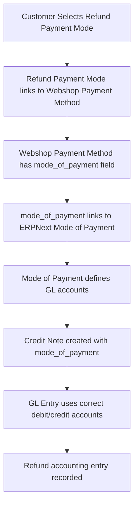

# Sales Return Feature Documentation

## Table of Contents

1. [Overview](#overview)
2. [Architecture](#architecture)
3. [Setup & Configuration](#setup--configuration)
4. [API Reference](#api-reference)
5. [User Guides](#user-guides)
6. [Technical Details](#technical-details)
7. [Troubleshooting](#troubleshooting)

---

## Overview

The Sales Return feature allows customers to submit return requests for delivered orders through the webshop. It integrates with ERPNext's inventory and accounting systems to handle both stock adjustments and financial refunds.

### Key Features

- **Customer Self-Service**: Customers can submit return requests from the frontend
- **Configurable Return Window**: Admin-defined eligibility period after delivery
- **Multiple Refund Methods**: Support for Cash and Bank Transfer refunds
- **Complete Accounting Integration**: Proper GL account mapping through Mode of Payment
- **Dual Document Creation**: Automated creation of both Delivery Note (Return) and Credit Note
- **Workflow-Based Approval**: Admin approval required before processing
- **Comprehensive Validation**: Business rules enforcement at every step

### Business Flow

```
Customer Side:
1. View eligible orders (delivered within return window)
2. Select order and return reason
3. Choose refund payment method
4. Fill bank details (if Bank Transfer)
5. Upload supporting documents
6. Submit return request

Admin Side:
1. Review return request in ERPNext
2. Approve/Reject via workflow
3. Process return documents (creates DN + Credit Note)
4. System updates stock and creates refund accounting entries
```

---

## Architecture

### DocTypes

#### 1. Return Reason (Master Data)

Master data for standardized return reasons.

**Fields:**

- `reason_name` (Data, Required, Unique): Display name
- `description` (Text): Detailed description
- `enabled` (Check): Active status

**Location**: `webshop/webshop/doctype/return_reason/`

#### 2. Return Request Item (Child Table)

Child table storing items included in a return request.

**Fields:**

- `sales_order_item` (Link): Reference to original Sales Order Item
- `item_code` (Data, Read-only): Auto-fetched from Sales Order
- `item_name` (Data, Read-only): Auto-fetched from Sales Order
- `qty` (Float, Read-only): Quantity to return
- `rate` (Currency, Read-only): Item rate
- `amount` (Currency, Read-only): Calculated total

**Location**: `webshop/webshop/doctype/return_request_item/`

#### 3. Return Request (Main DocType)

Main document for managing return requests.

**Sections:**

**Order Information:**

- `sales_order` (Link, Required): Original sales order
- `customer` (Link, Read-only): Auto-populated
- `sales_invoice` (Link, Read-only): Auto-populated
- `delivery_note` (Link, Read-only): Auto-populated
- `posting_date` (Date): Request submission date

**Return Details:**

- `return_reason` (Link, Required): Selected reason
- `other_reason` (Text Editor): Custom reason if "Other" selected
- `supporting_documents` (Attach): Uploaded proof

**Refund Information:**

- `refund_payment_mode` (Link, Required): Links to Webshop Payment Method
- `bank_name` (Data): Required for Transfer Manual
- `account_number` (Data): Required for Transfer Manual
- `account_holder_name` (Data): Required for Transfer Manual

**Items:**

- `items` (Table): Return Request Item child table

**Status:**

- `status` (Select, Read-only): Current status
- `workflow_state` (Link): Workflow integration

**Return Documents:**

- `return_delivery_note` (Link, Read-only): Created return DN
- `credit_note` (Link, Read-only): Created credit note

**Status Values:**

- Draft
- Pending Approval
- Approved
- Processing
- Completed
- Rejected

**Location**: `webshop/webshop/doctype/return_request/`

### Modified DocTypes

#### Webshop Settings

Added return policy configuration fields:

- `enable_returns` (Check): Master switch
- `return_eligibility_days` (Int, Default=7): Days after delivery
- `return_policy_description` (Text Editor): Policy text for customers

#### Webshop Payment Method

Added return support:

- `allow_on_return` (Check): Enable payment method for refunds

### Database Schema

```sql
-- Return Reason
CREATE TABLE `tabReturn Reason` (
  `name` VARCHAR(140) PRIMARY KEY,
  `reason_name` VARCHAR(140) UNIQUE NOT NULL,
  `description` TEXT,
  `enabled` INT DEFAULT 1
);

-- Return Request
CREATE TABLE `tabReturn Request` (
  `name` VARCHAR(140) PRIMARY KEY,
  `sales_order` VARCHAR(140) NOT NULL,
  `customer` VARCHAR(140),
  `sales_invoice` VARCHAR(140),
  `delivery_note` VARCHAR(140),
  `return_reason` VARCHAR(140) NOT NULL,
  `refund_payment_mode` VARCHAR(140) NOT NULL,
  `status` VARCHAR(50),
  `return_delivery_note` VARCHAR(140),
  `credit_note` VARCHAR(140),
  -- ... other fields
);

-- Return Request Item
CREATE TABLE `tabReturn Request Item` (
  `name` VARCHAR(140) PRIMARY KEY,
  `parent` VARCHAR(140),
  `sales_order_item` VARCHAR(140),
  `item_code` VARCHAR(140),
  `qty` DECIMAL(18,6),
  `rate` DECIMAL(18,6),
  `amount` DECIMAL(18,6)
);
```

---

## Setup & Configuration

### Initial Setup

#### 1. Run Migration

```bash
# Inside Docker container
bench --site development.localhost migrate
```

This will:

- Create Return Reason, Return Request Item, and Return Request tables
- Add custom fields to Webshop Settings and Webshop Payment Method
- Create default return reasons

#### 2. Configure Webshop Settings

Navigate to: **Webshop Settings** → **Return Policy Settings**

**Fields to Configure:**

1. ✅ **Enable Returns**: Check this to activate return functionality
2. **Return Eligibility Days**: Set number of days (default: 7)
3. **Return Policy Description**: Add customer-facing policy text

**Example Configuration:**

```
Enable Returns: ✓
Return Eligibility Days: 14
Return Policy Description:
"We accept returns within 14 days of delivery for items in original condition
with tags attached. Refunds will be processed within 5-7 business days."
```

#### 3. Configure Payment Methods for Returns

Navigate to: **Webshop Payment Method** → Select each payment method

**For Cash Payment Method:**

1. Open "Cash" payment method
2. Check **Allow on Return** checkbox
3. Ensure **Mode of Payment** is set (required for accounting)
4. Save

**For Bank Transfer Payment Method:**

1. Open "Bank Transfer" payment method
2. Check **Allow on Return** checkbox
3. Ensure **Mode of Payment** is set
4. Ensure **Bank Account** is configured
5. Save

**Critical**: `mode_of_payment` must be configured for proper GL account mapping in Credit Notes!

#### 4. Create Return Reasons (if not auto-created)

Navigate to: **Return Reason** → **New**

Default reasons created by patch:

- Defective Product
- Wrong Item Received
- Size/Color Mismatch
- Damaged During Delivery
- Changed Mind
- Other

You can add custom reasons as needed.

#### 5. Setup Email Templates (Optional)

Create email templates for:

- Return request confirmation (to customer)
- Return approved notification (to customer)
- Return rejected notification (to customer)
- New return request alert (to admin)

---

## API Reference

All API endpoints are located in: `webshop/webshop/api/returns.py`

### Customer-Facing APIs

#### 1. Get Eligible Orders for Return

```python
@frappe.whitelist()
def get_eligible_orders_for_return()
```

**Description**: Retrieves customer's delivered sales orders eligible for return.

**Authentication**: Required (customer session)

**Returns**:

```json
[
  {
    "sales_order": "SO-0001",
    "transaction_date": "2026-01-01",
    "grand_total": 1500.0,
    "delivery_note": "DN-0001",
    "delivery_date": "2026-01-05",
    "days_since_delivery": 5,
    "eligible_until": "2026-01-19",
    "items": [
      {
        "item_code": "ITEM-001",
        "item_name": "Product Name",
        "qty": 2,
        "rate": 750.0,
        "amount": 1500.0
      }
    ]
  }
]
```

**Business Rules:**

- Only delivered orders (Delivery Note submitted)
- Within return eligibility window (configurable days)
- No existing return request
- Excludes subscription orders

**Usage Example:**

```javascript
frappe.call({
  method: "webshop.webshop.api.returns.get_eligible_orders_for_return",
  callback: function (r) {
    console.log(r.message); // Array of eligible orders
  },
});
```

---

#### 2. Get Return Reasons

```python
@frappe.whitelist()
def get_return_reasons()
```

**Description**: Retrieves all active return reasons for dropdown selection.

**Authentication**: Required

**Returns**:

```json
[
  {
    "name": "Defective Product",
    "reason_name": "Defective Product",
    "description": "Product has manufacturing defects or quality issues"
  },
  {
    "name": "Wrong Item Received",
    "reason_name": "Wrong Item Received",
    "description": "Received incorrect item or different from what was ordered"
  }
]
```

**Usage Example:**

```javascript
frappe.call({
  method: "webshop.webshop.api.returns.get_return_reasons",
  callback: function (r) {
    let reasons = r.message;
    // Populate dropdown
  },
});
```

---

#### 3. Get Refund Payment Methods

```python
@frappe.whitelist()
def get_refund_payment_methods()
```

**Description**: Retrieves payment methods enabled for refunds (`allow_on_return=1`).

**Authentication**: Required

**Returns**:

```json
[
  {
    "name": "Cash",
    "title": "Cash",
    "payment_type": "Cash",
    "mode_of_payment": "Cash",
    "description": "Cash refund at store"
  },
  {
    "name": "Bank Transfer - BCA",
    "title": "Bank Transfer - BCA",
    "payment_type": "Transfer Manual",
    "mode_of_payment": "Bank Transfer",
    "description": "Refund via bank transfer"
  }
]
```

**Usage Example:**

```javascript
frappe.call({
  method: "webshop.webshop.api.returns.get_refund_payment_methods",
  callback: function (r) {
    let methods = r.message;
    // Build payment method selection
  },
});
```

---

#### 4. Create Return Request

```python
@frappe.whitelist()
def create_return_request(data)
```

**Description**: Creates a new return request from customer submission.

**Authentication**: Required (customer session)

**Parameters**:

```json
{
  "sales_order": "SO-0001",
  "return_reason": "Defective Product",
  "other_reason": "Optional custom reason",
  "supporting_documents": "/files/proof.jpg",
  "refund_payment_mode": "Bank Transfer - BCA",
  "bank_name": "Bank Central Asia",
  "account_number": "1234567890",
  "account_holder_name": "John Doe"
}
```

**Returns**:

```json
{
  "name": "RET-REQ-2026-00001",
  "sales_order": "SO-0001",
  "status": "Draft"
}
```

**Validations Performed:**

- ✅ Sales order belongs to current customer
- ✅ Sales order is delivered
- ✅ Within return eligibility window
- ✅ No duplicate return request exists
- ✅ Refund payment mode has `allow_on_return=1`
- ✅ Bank details required if payment type is "Transfer Manual"
- ✅ Other reason required if return reason is "Other"

**Usage Example:**

```javascript
frappe.call({
  method: "webshop.webshop.api.returns.create_return_request",
  args: {
    data: {
      sales_order: "SO-0001",
      return_reason: "Defective Product",
      refund_payment_mode: "Bank Transfer - BCA",
      bank_name: "Bank Central Asia",
      account_number: "1234567890",
      account_holder_name: "John Doe",
    },
  },
  callback: function (r) {
    console.log("Return request created:", r.message.name);
  },
});
```

---

#### 5. Get Customer Return Requests

```python
@frappe.whitelist()
def get_customer_return_requests(filters=None)
```

**Description**: Retrieves customer's return requests with filtering and pagination.

**Authentication**: Required (customer session)

**Parameters**:

```json
{
  "status": "Pending Approval", // Optional
  "start": 0, // Optional, for pagination
  "page_length": 20 // Optional, default 20
}
```

**Returns**:

```json
[
  {
    "name": "RET-REQ-2026-00001",
    "sales_order": "SO-0001",
    "posting_date": "2026-01-10",
    "return_reason": "Defective Product",
    "refund_payment_mode": "Bank Transfer - BCA",
    "status": "Pending Approval",
    "return_delivery_note": null,
    "credit_note": null
  }
]
```

**Usage Example:**

```javascript
frappe.call({
  method: "webshop.webshop.api.returns.get_customer_return_requests",
  args: {
    filters: {
      status: "Pending Approval",
      start: 0,
      page_length: 10,
    },
  },
  callback: function (r) {
    let requests = r.message;
    // Display in table
  },
});
```

---

#### 6. Get Return Request Detail

```python
@frappe.whitelist()
def get_return_request_detail(name)
```

**Description**: Retrieves complete details of a specific return request.

**Authentication**: Required (validates customer ownership)

**Parameters**:

- `name` (string): Return Request ID

**Returns**:

```json
{
  "name": "RET-REQ-2026-00001",
  "sales_order": "SO-0001",
  "customer": "CUST-0001",
  "posting_date": "2026-01-10",
  "return_reason": "Defective Product",
  "other_reason": null,
  "supporting_documents": "/files/proof.jpg",
  "refund_payment_mode": "Bank Transfer - BCA",
  "payment_method_title": "Bank Transfer - BCA",
  "payment_type": "Transfer Manual",
  "bank_name": "Bank Central Asia",
  "account_number": "1234567890",
  "account_holder_name": "John Doe",
  "items": [
    {
      "item_code": "ITEM-001",
      "item_name": "Product Name",
      "qty": 2,
      "rate": 750.0,
      "amount": 1500.0
    }
  ],
  "status": "Approved",
  "return_delivery_note": "DN-RET-00001",
  "credit_note": "CN-00001"
}
```

**Usage Example:**

```javascript
frappe.call({
  method: "webshop.webshop.api.returns.get_return_request_detail",
  args: {
    name: "RET-REQ-2026-00001",
  },
  callback: function (r) {
    let detail = r.message;
    // Display detailed view
  },
});
```

---

### Admin-Only APIs

#### 7. Process Return Documents

```python
@frappe.whitelist()
def process_return_documents(return_request_name)
```

**Description**: Creates Delivery Note (Return) and Sales Invoice (Credit Note) for an approved return request.

**Authentication**: Required (write permission on Return Request)

**Permissions**: Webshop Manager, System Manager

**Parameters**:

- `return_request_name` (string): Return Request ID

**Process:**

1. Validates Return Request is submitted (approved)
2. Creates Delivery Note (Return) using ERPNext's `make_sales_return()`
3. Creates Sales Invoice (Credit Note) with `mode_of_payment` from refund payment mode
4. Links both documents to Return Request
5. Updates status to "Completed"

**Returns**:

```json
{
  "return_delivery_note": "DN-RET-00001",
  "credit_note": "CN-00001"
}
```

**Usage Example:**

```javascript
// Admin desk script
frappe.call({
  method: "webshop.webshop.api.returns.process_return_documents",
  args: {
    return_request_name: "RET-REQ-2026-00001",
  },
  callback: function (r) {
    frappe.msgprint(
      `Created: ${r.message.return_delivery_note}, ${r.message.credit_note}`
    );
  },
});
```

**Important Notes:**

- ⚠️ Can only be called once per Return Request
- ⚠️ Return Request must be in "Approved" status
- ⚠️ Auto-sets `mode_of_payment` on Credit Note for correct GL mapping
- ⚠️ Submits both DN and Credit Note automatically

---

## User Guides

### Customer Guide: How to Submit a Return Request

#### Step 1: Check Eligibility

1. Login to webshop
2. Navigate to "My Orders" or "Returns" section
3. View list of orders eligible for return
4. Note: Only delivered orders within the return window are shown

#### Step 2: Select Order to Return

1. Click on order you want to return
2. Review order details and items
3. Note: All items in the order will be returned (admin can select specific items later)

#### Step 3: Provide Return Details

1. **Select Return Reason**: Choose from dropdown

   - Defective Product
   - Wrong Item Received
   - Size/Color Mismatch
   - Damaged During Delivery
   - Changed Mind
   - Other (requires additional explanation)

2. **If "Other" selected**: Provide detailed explanation in text box

3. **Upload Supporting Documents**:
   - Click "Choose File" or drag & drop
   - Supported formats: JPG, PNG, PDF
   - Maximum size: 5MB
   - Examples: Photos of defect, delivery receipt

#### Step 4: Choose Refund Method

1. **Select Payment Method** from available options:

   - Cash (if enabled)
   - Bank Transfer (if enabled)

2. **If Bank Transfer selected**, provide:
   - Bank Name (e.g., "Bank Central Asia")
   - Account Number (10-16 digits)
   - Account Holder Name (must match account)

#### Step 5: Review and Submit

1. Review all information
2. Read return policy
3. Click "Submit Return Request"
4. Confirmation message will appear
5. Return Request ID will be generated (e.g., RET-REQ-2026-00001)

#### Step 6: Track Return Status

1. Navigate to "My Returns"
2. View status of your return request:

   - **Draft**: Being prepared
   - **Pending Approval**: Awaiting admin review
   - **Approved**: Approved, awaiting processing
   - **Processing**: Return documents being created
   - **Completed**: Return processed, refund initiated
   - **Rejected**: Return request denied

3. Click on return request to view details
4. Download supporting documents if needed
5. View created Delivery Note and Credit Note (when completed)

---

### Admin Guide: Processing Return Requests

#### Step 1: Review Return Request

1. Navigate to: **Return Request** list
2. Filter by status: "Pending Approval"
3. Open return request to review:
   - Customer details
   - Original sales order and delivery
   - Return reason and supporting documents
   - Refund payment method
   - Items to be returned

#### Step 2: Verify Return Eligibility

Check:

- ✅ Order was delivered
- ✅ Within return eligibility window
- ✅ Items are in returnable condition (based on documents)
- ✅ Return reason is valid
- ✅ Bank details are correct (if Bank Transfer)

#### Step 3: Approve or Reject

**To Approve:**

1. Click **Workflow** button
2. Select **Approve**
3. Add approval comment (optional)
4. Click **Submit**
5. Status changes to "Approved"

**To Reject:**

1. Click **Workflow** button
2. Select **Reject**
3. Add rejection reason (mandatory)
4. Click **Submit**
5. Customer will be notified
6. Status changes to "Rejected"

#### Step 4: Process Return Documents

After approval:

1. Open approved Return Request
2. Click **Process Return Documents** button
3. System will:

   - Create Delivery Note (Return)
   - Create Sales Invoice (Credit Note)
   - Link both to Return Request
   - Update stock quantities
   - Create GL entries
   - Set status to "Completed"

4. Verify created documents:
   - **Delivery Note**: Check item quantities, warehouse
   - **Credit Note**: Check amounts, mode_of_payment, GL entries

#### Step 5: Process Refund

**For Cash Refund:**

1. Note the Credit Note number
2. Process cash refund at store/counter
3. Update customer communication

**For Bank Transfer:**

1. Review bank details in Return Request
2. Initiate bank transfer for refund amount
3. Use Credit Note number as reference
4. Update customer with transfer details

#### Step 6: Customer Communication

Send notifications at each stage:

- Return request received
- Approved/Rejected with reason
- Return processed
- Refund initiated

---

## Technical Details

### Validation Logic

#### Controller: `return_request.py`

**1. validate_refund_payment_mode()**

```python
def validate_refund_payment_mode(self):
    """Validate refund payment mode has allow_on_return enabled"""
    if self.refund_payment_mode:
        payment_method = frappe.get_doc("Webshop Payment Method", self.refund_payment_mode)
        if not payment_method.get("allow_on_return"):
            frappe.throw(_("Selected payment method {0} is not allowed for returns"))
```

**Purpose**: Ensures only approved payment methods can be used for refunds.

---

**2. validate_bank_details()**

```python
def validate_bank_details(self):
    """Validate bank details if payment type is Transfer Manual"""
    if self.refund_payment_mode:
        payment_method = frappe.get_doc("Webshop Payment Method", self.refund_payment_mode)
        if payment_method.payment_type == "Transfer Manual":
            if not self.bank_name:
                frappe.throw(_("Bank Name is required for Transfer Manual payment method"))
            if not self.account_number:
                frappe.throw(_("Account Number is required for Transfer Manual payment method"))
            if not self.account_holder_name:
                frappe.throw(_("Account Holder Name is required for Transfer Manual payment method"))
```

**Purpose**: Enforces bank detail requirements for bank transfer refunds.

---

**3. validate_other_reason()**

```python
def validate_other_reason(self):
    """Validate other_reason is provided if return_reason is 'Other'"""
    if self.return_reason == "Other" and not self.other_reason:
        frappe.throw(_("Please provide details in 'Other Reason' field"))
```

**Purpose**: Requires explanation when "Other" is selected as return reason.

---

**4. validate_sales_order_delivered()**

```python
def validate_sales_order_delivered(self):
    """Validate that sales order has been delivered"""
    delivery_notes = frappe.get_all("Delivery Note Item",
        filters={"against_sales_order": self.sales_order, "docstatus": 1},
        fields=["parent"]
    )
    if not delivery_notes:
        frappe.throw(_("Sales Order {0} has not been delivered yet"))
```

**Purpose**: Prevents returns for undelivered orders.

---

**5. validate_return_window()**

```python
def validate_return_window(self):
    """Validate return is within eligibility window"""
    settings = frappe.get_single("Webshop Settings")
    eligibility_days = settings.return_eligibility_days or 7

    delivery_date = frappe.db.get_value("Delivery Note", self.delivery_note, "posting_date")
    cutoff_date = add_days(delivery_date, eligibility_days)
    today = getdate(nowdate())

    if today > getdate(cutoff_date):
        frappe.throw(_("Return window has expired. Returns are allowed within {0} days of delivery"))
```

**Purpose**: Enforces configurable return window policy.

---

**6. validate_duplicate_return()**

```python
def validate_duplicate_return(self):
    """Validate no duplicate return request for same sales order"""
    if self.is_new():
        existing = frappe.db.exists("Return Request", {
            "sales_order": self.sales_order,
            "docstatus": ["!=", 2],  # Not cancelled
            "name": ["!=", self.name]
        })
        if existing:
            frappe.throw(_("Return Request already exists for Sales Order {0}"))
```

**Purpose**: Prevents multiple return requests for the same order.

---

### Auto-Population Logic

**populate_customer_and_documents()**

```python
def populate_customer_and_documents(self):
    """Auto-populate customer, sales_invoice, and delivery_note from sales order"""
    if self.sales_order:
        so = frappe.get_doc("Sales Order", self.sales_order)
        self.customer = so.customer

        # Get Sales Invoice
        invoices = frappe.get_all("Sales Invoice Item",
            filters={"sales_order": self.sales_order, "docstatus": 1},
            fields=["parent"], limit=1
        )
        if invoices:
            self.sales_invoice = invoices[0].parent

        # Get Delivery Note
        delivery_notes = frappe.get_all("Delivery Note Item",
            filters={"against_sales_order": self.sales_order, "docstatus": 1},
            fields=["parent"], limit=1
        )
        if delivery_notes:
            self.delivery_note = delivery_notes[0].parent
```

**populate_items_from_sales_order()**

```python
def populate_items_from_sales_order(self):
    """Auto-populate all items from sales order"""
    if self.sales_order and not self.items:
        so = frappe.get_doc("Sales Order", self.sales_order)

        for item in so.items:
            self.append("items", {
                "sales_order_item": item.name,
                "item_code": item.item_code,
                "item_name": item.item_name,
                "qty": item.qty,
                "rate": item.rate,
                "amount": item.amount
            })
```

---

### Return Document Creation

**create_return_delivery_note()**

```python
def create_return_delivery_note(self):
    """Create Delivery Note (Return) from original delivery note"""
    from erpnext.stock.doctype.delivery_note.delivery_note import make_sales_return

    return_dn = make_sales_return(self.delivery_note)
    return_dn.save()
    return_dn.submit()

    return return_dn
```

**Purpose**: Uses ERPNext's built-in function to create return delivery note with correct stock ledger entries.

---

**create_credit_note()**

```python
def create_credit_note(self):
    """Create Sales Invoice (Credit Note) from original sales invoice"""
    from erpnext.accounts.doctype.sales_invoice.sales_invoice import make_sales_return

    credit_note = make_sales_return(self.sales_invoice)

    # Set mode_of_payment from refund_payment_mode for correct GL mapping
    if self.refund_payment_mode:
        payment_method = frappe.get_doc("Webshop Payment Method", self.refund_payment_mode)
        if payment_method.mode_of_payment:
            credit_note.mode_of_payment = payment_method.mode_of_payment

    credit_note.save()
    credit_note.submit()

    return credit_note
```

**Purpose**: Creates credit note with proper mode_of_payment for correct GL account mapping in refund accounting entries.

---

### Accounting Flow



**Example:**

1. Customer selects "Bank Transfer - BCA" for refund
2. Webshop Payment Method "Bank Transfer - BCA" has `mode_of_payment = "Bank Transfer"`
3. Mode of Payment "Bank Transfer" has account configured as "BCA Bank Account"
4. Credit Note is created with `mode_of_payment = "Bank Transfer"`
5. GL Entry debits "BCA Bank Account" and credits appropriate income/receivable accounts

This ensures:

- ✅ Correct bank account is debited for refund
- ✅ Proper audit trail
- ✅ Accurate financial reporting
- ✅ Bank reconciliation works correctly

---

## Troubleshooting

### Common Issues

#### 1. Migration Fails with "No module named 'frappe.core.doctype.return_reason'"

**Cause**: Trying to run patch before DocType tables are created.

**Solution**: Patch has been fixed to check if table exists first. Re-run migration:

```bash
bench --site development.localhost migrate
```

---

#### 2. "Selected payment method is not allowed for returns"

**Cause**: Payment method doesn't have `allow_on_return` checkbox enabled.

**Solution**:

1. Go to Webshop Payment Method
2. Open the payment method
3. Check **Allow on Return** checkbox
4. Ensure **Mode of Payment** is set
5. Save

---

#### 3. "Bank Account is required for Transfer Manual payment type"

**Cause**: Creating a Webshop Payment Method with payment_type "Transfer Manual" without bank_account.

**Solution**:

1. Open the Payment Method
2. Set **Bank Account** field
3. Save

---

#### 4. "Return window has expired"

**Cause**: Trying to create return request after eligibility period.

**Solution**:

1. Check Webshop Settings → Return Eligibility Days
2. Increase if needed
3. Or reject the return request with appropriate reason

---

#### 5. GL Entry uses wrong account in Credit Note

**Cause**: `mode_of_payment` not set correctly.

**Solution**:

1. Verify Webshop Payment Method has **Mode of Payment** set
2. Verify Mode of Payment has accounts configured
3. Check company-specific account settings
4. Recreate return documents if needed

---

#### 6. Cannot find return in eligible orders list

**Possible Causes:**

- Order not delivered yet
- Outside return window
- Already has a return request
- Is a subscription order

**Solution**:
Check:

```sql
-- Check delivery status
SELECT * FROM `tabDelivery Note Item`
WHERE against_sales_order = 'SO-XXXX' AND docstatus = 1;

-- Check existing return requests
SELECT * FROM `tabReturn Request`
WHERE sales_order = 'SO-XXXX' AND docstatus != 2;

-- Check if subscription order
SELECT * FROM `tabSubscription`
WHERE reference_document = 'SO-XXXX';
```

---

### Testing

#### Run All Tests

```bash
# Return Reason tests
bench --site development.localhost run-tests --module webshop.webshop.doctype.return_reason.test_return_reason

# Return Request tests
bench --site development.localhost run-tests --module webshop.webshop.doctype.return_request.test_return_request

# API tests
bench --site development.localhost run-tests --module webshop.tests.test_return_apis
```

#### Create Test Data

```python
# Create test customer
customer = frappe.get_doc({
    "doctype": "Customer",
    "customer_name": "Test Customer",
    "customer_group": "All Customer Groups",
    "territory": "All Territories"
}).insert()

# Create test payment method
payment_method = frappe.get_doc({
    "doctype": "Webshop Payment Method",
    "payment_method_name": "Test Cash",
    "payment_type": "Cash",
    "mode_of_payment": "Cash",
    "enabled": 1,
    "allow_on_return": 1
}).insert()

# Create test return reason
reason = frappe.get_doc({
    "doctype": "Return Reason",
    "reason_name": "Test Defective",
    "enabled": 1
}).insert()
```

---

## Appendices

### File Structure

```
webshop/
├── webshop/
│   ├── doctype/
│   │   ├── return_reason/
│   │   │   ├── return_reason.json
│   │   │   ├── return_reason.py
│   │   │   ├── test_return_reason.py
│   │   │   └── __init__.py
│   │   ├── return_request_item/
│   │   │   ├── return_request_item.json
│   │   │   ├── return_request_item.py
│   │   │   └── __init__.py
│   │   ├── return_request/
│   │   │   ├── return_request.json
│   │   │   ├── return_request.py
│   │   │   ├── test_return_request.py
│   │   │   └── __init__.py
│   │   ├── webshop_settings/
│   │   │   ├── webshop_settings.json (MODIFIED)
│   │   │   └── webshop_settings.py (MODIFIED)
│   │   └── webshop_payment_method/
│   │       └── webshop_payment_method.json (MODIFIED)
│   └── api/
│       └── returns.py (NEW)
├── tests/
│   └── test_return_apis.py (NEW)
├── patches/
│   ├── create_return_reason_master_data.py (NEW)
│   └── patches.txt (MODIFIED)
└── docs/
    └── RETURNS_DOCUMENTATION.md (THIS FILE)
```

### Version History

| Version | Date       | Changes         |
| ------- | ---------- | --------------- |
| 1.0.0   | 2026-01-10 | Initial release |

### Support

For issues or questions:

1. Check this documentation
2. Review implementation plan
3. Check test files for examples
4. Contact development team

---

**Last Updated**: 2026-01-10
**Maintained By**: Webshop Development Team
