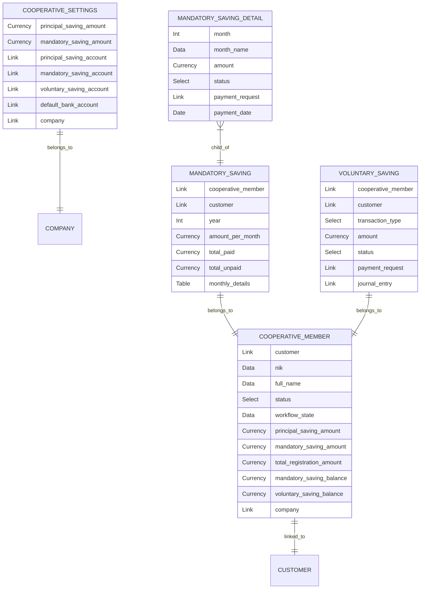
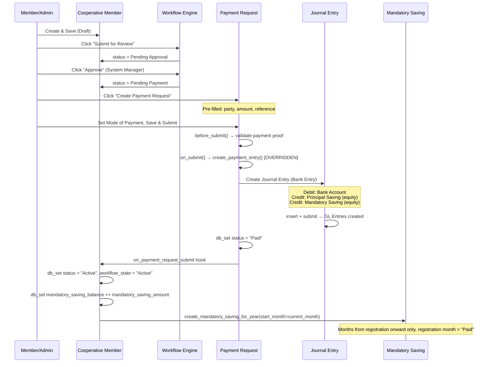
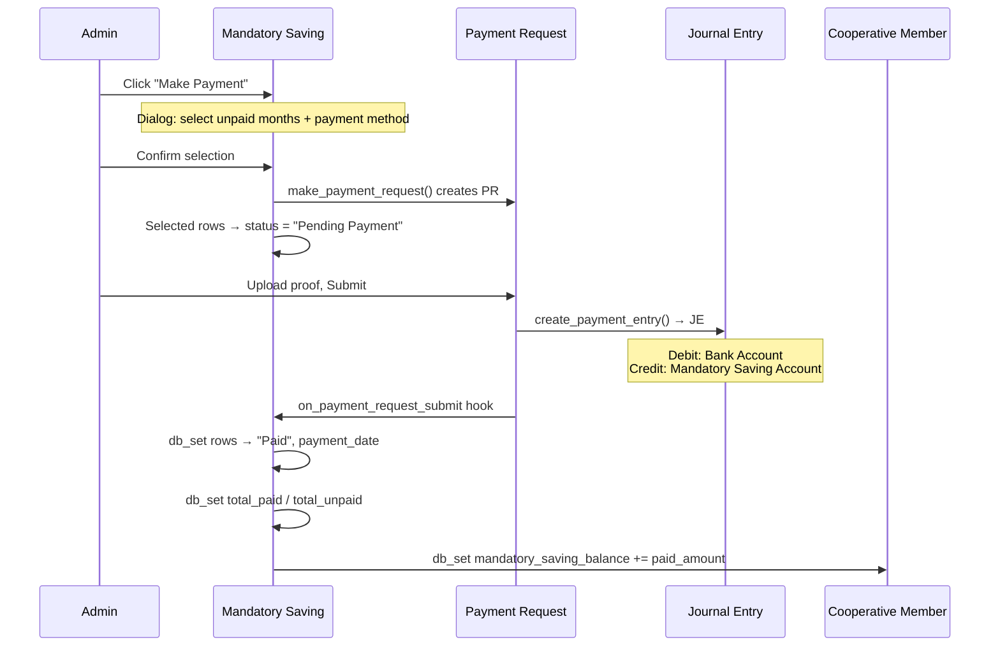
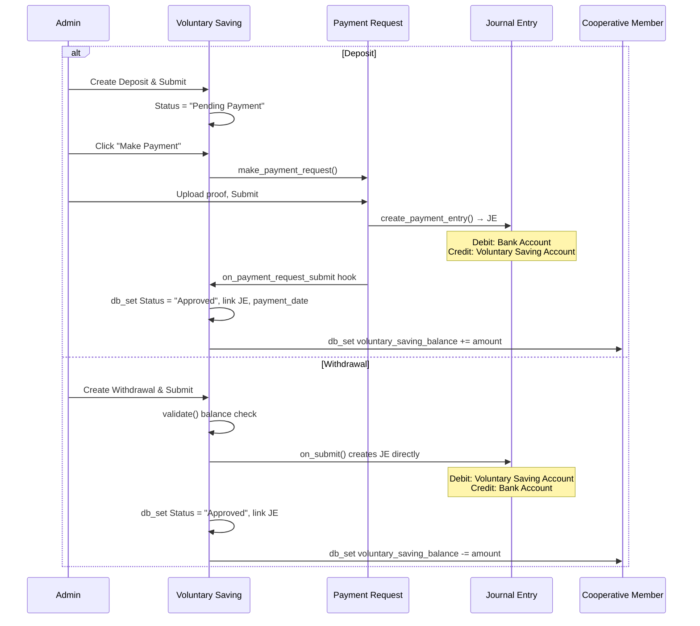
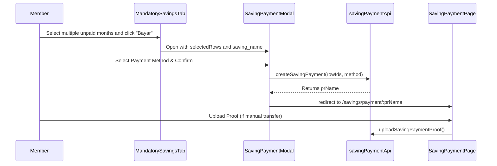

# Cooperative Savings Module — Architecture & Walkthrough

> Documentation for the Cooperative (Koperasi) Savings module built on the Webshop app.  
> Last updated: 2026-02-24

---

## 1. Overview

The Cooperative Savings module manages member registration, savings collection, and accounting journal entries for a cooperative (koperasi). It integrates with ERPNext's accounting system via **Journal Entries** — deliberately bypassing the Payment Entry module to avoid its strict validations against custom doctypes.

### Key Design Decisions

> **Journal Entry over Payment Entry** — ERPNext's `Payment Entry` module hardcodes validations for standard doctypes (Sales Invoice, Sales Order, etc.) and rejects custom references. We use direct Journal Entry creation instead.

> **Frappe Workflow over Submittable** — Cooperative Member is a **non-Submittable** DocType. Member approval/rejection is controlled by the native Frappe Workflow engine ("Cooperative Registration Flow"), which provides role-based action buttons, audit trail, and optional email notifications — without custom code.

> **`frappe.db.set_value()` over `doc.save()`** — When updating status/balances after payment, we use `db.set_value` directly to bypass the Workflow engine (which would revert `workflow_state` back to the previous state if `doc.save()` is called).

---

## 2. DocType Architecture



### 2.1 Cooperative Settings (Single)

Central configuration. All amounts and accounts are sourced from here.

| Field | Type | Purpose |
|---|---|---|
| `principal_saving_amount` | Currency | Default registration principal (Simpanan Pokok), default: 250,000 |
| `mandatory_saving_amount` | Currency | Monthly mandatory saving (Simpanan Wajib), default: 50,000 |
| `principal_saving_account` | Link → Account | Equity account for principal savings |
| `mandatory_saving_account` | Link → Account | Equity account for mandatory savings |
| `voluntary_saving_account` | Link → Account | Equity account for voluntary savings |
| `default_bank_account` | Link → Account | Fallback bank/cash account for JE debit |
| `company` | Link → Company | Default company |

### 2.2 Cooperative Member (Non-Submittable, Workflow-controlled)

Member registration with personal data, KTP address, emergency contact, and auto-populated saving amounts.

> [!IMPORTANT]
> This is **not** a Submittable DocType (`is_submittable = 0`). Status transitions are controlled entirely by the Frappe **Workflow** — not the Submit/Cancel buttons. This avoids the Submittable constraint on field edits.

**Key fields:** `customer`, `nik`, `full_name`, `status`, `workflow_state`, `principal_saving_amount`, `mandatory_saving_amount`, `total_registration_amount`, `mandatory_saving_balance`, `voluntary_saving_balance`, `company`, `company_currency`

**Balance fields (read-only, auto-maintained):**

| Field | Updated by |
|---|---|
| `mandatory_saving_balance` | `on_payment_request_submit()` hook when a Mandatory Saving or registration PR is paid |
| `voluntary_saving_balance` | `on_payment_request_submit()` for deposits; `on_submit()` on Voluntary Saving for withdrawals |

**Workflow — "Cooperative Registration Flow":**

| From State | Action | To State | Role |
|---|---|---|---|
| Draft | Submit for Review | Pending Approval | Customer, System Manager |
| Pending Approval | Approve | Pending Payment | System Manager |
| Pending Approval | Reject | Rejected | System Manager |
| Rejected | Resubmit | Pending Approval | Customer, System Manager |
| Pending Payment | *(automatic on PR payment)* | Active | — |

> The `Pending Payment → Active` transition is **not** a Workflow action — it's triggered programmatically via `frappe.db.set_value()` inside `on_payment_request_submit()`. This bypasses the Workflow engine, which would otherwise revert `workflow_state` if `doc.save()` is used.

**Naming:** `COOP-.YYYY.-.#####`

**Dashboard links:** Payment Request (Payment group), Mandatory Saving, Voluntary Saving (Saving group)

**Client-side buttons:**
- **Create Payment Request** — shown when `status = Pending Payment` and no PR exists
- **View Payment Request** — shown when `status = Pending Payment` and PR already exists
- **Create Next Year Saving** — shown when `status = Active`

### 2.3 Mandatory Saving (Submittable)

Tracks 12-month mandatory savings per member per year.

**Naming:** `{cooperative_member}-{year}` (e.g. `COOP-2026-00001-2026`)

**Key fields:** `cooperative_member`, `year`, `amount_per_month`, `monthly_details` (child table of 12 rows)

### 2.4 Mandatory Saving Detail (Child Table)

Each row = one month. Fields: `month`, `month_name`, `amount`, `status` (Unpaid/Pending Payment/Paid), `payment_request`, `payment_date`

### 2.5 Voluntary Saving (Submittable)

Ad-hoc deposits or withdrawals.

**Naming:** `VOL-SAV-.YYYY.-.#####`

**Key fields:** `cooperative_member`, `transaction_type` (Deposit/Withdrawal), `amount`, `status`, `payment_request`, `journal_entry`, `payment_date`

---

## 3. Registration & Payment Flow



### 3.1 Bank Account Resolution

The debit account in the Journal Entry is determined by this priority:

1. **Mode of Payment Account** — looks up `Mode of Payment Account` child table where `parent = mode_of_payment` and `company = company`
2. **Cooperative Settings** — `default_bank_account` as fallback
3. **Error** — throws if neither is set

### 3.2 Journal Entry Structure (Registration)

| Row | Account | Debit | Credit |
|---|---|---|---|
| 1 | Bank Account (from Mode of Payment / Settings) | `total_registration_amount` | 0 |
| 2 | Principal Saving Account (equity) | 0 | `principal_saving_amount` |
| 3 | Mandatory Saving Account (equity) | 0 | `mandatory_saving_amount` |

**Total Debit = Total Credit = `total_registration_amount`** (= principal + mandatory)

### 3.3 Mandatory Saving — Monthly Payment Flow

The Mandatory Saving "Make Payment" button allows admins to pay unpaid months:



### 3.4 Journal Entry Structure (Mandatory Saving Payment)

| Row | Account | Debit | Credit |
|---|---|---|---|
| 1 | Bank Account (from Mode of Payment / Settings) | `total of selected months` | 0 |
| 2 | Mandatory Saving Account (equity) | 0 | `total of selected months` |

### 3.5 Voluntary Saving Flow

Voluntary Savings handle both Deposits (money coming in, via Payment Request) and Withdrawals (money going out, via direct Journal Entry).



### 3.6 Payment Request Cancellation

When a Payment Request is **cancelled**, a `before_cancel` hook clears back-linked fields to prevent Frappe's link check from blocking cancellation:

| Reference DocType | What is cleared |
|---|---|
| Mandatory Saving | `payment_request` field on linked Detail rows; status reverted from `Pending Payment` → `Unpaid` |
| Voluntary Saving | `payment_request` field on the VS document |
| Cooperative Member | `status` reverted from `Pending Payment` → `Draft` (so a new PR can be created) |

---

## 4. File Map

### Core DocTypes

| File | Purpose |
|---|---|
| `webshop/doctype/cooperative_settings/cooperative_settings.json` | Settings schema |
| `webshop/doctype/cooperative_member/cooperative_member.json` | Member schema (non-submittable, workflow-controlled) |
| `webshop/doctype/cooperative_member/cooperative_member.py` | Member logic + `make_payment_request()` mapper |
| `webshop/doctype/cooperative_member/cooperative_member.js` | Client-side buttons (Create/View Payment Request, Create Next Year Saving) |
| `webshop/doctype/mandatory_saving/mandatory_saving.json` | Mandatory Saving schema |
| `webshop/doctype/mandatory_saving/mandatory_saving.py` | Mandatory Saving logic + `make_payment_request()` API |
| `webshop/doctype/mandatory_saving/mandatory_saving.js` | Client-side "Make Payment" button with unpaid month selector |
| `webshop/doctype/mandatory_saving_detail/mandatory_saving_detail.json` | Monthly detail child table |
| `webshop/doctype/voluntary_saving/voluntary_saving.json` | Voluntary Saving schema |
| `webshop/doctype/voluntary_saving/voluntary_saving.py` | Voluntary Saving logic (withdrawal JE, balance updates) |
| `webshop/doctype/voluntary_saving/voluntary_saving.js` | Client-side "Make Payment" button |

### Override & API

| File | Purpose |
|---|---|
| `webshop/doctype/override_doctype/payment_request.py` | **Core override** — `create_payment_entry()` creates JE instead of PE |
| `webshop/api/cooperative_payment.py` | `on_payment_request_submit()` hook, `before_payment_request_cancel()` hook, `create_mandatory_saving_for_year()`, `create_annual_mandatory_savings()`, `create_next_year_saving()` |
| `webshop/api/cooperative.py` | `register_member()`, `get_membership_status()`, `approve_member()`, `reject_member()` |
| `webshop/api/setup_cooperative_workflow.py` | One-time manual helper — `execute()` and `sync_workflow_states()` for debugging |

### Fixtures

| File | Purpose |
|---|---|
| `webshop/fixtures/workflow.json` | "Cooperative Registration Flow" Workflow definition |
| `webshop/fixtures/workflow_state.json` | Workflow States (Draft, Pending Approval, Pending Payment, Active, Rejected) |
| `webshop/fixtures/workflow_action_master.json` | Workflow Actions (Submit for Review, Approve, Reject, Resubmit) |

> Fixtures are synced automatically during `bench migrate` and on fresh installs via `bench install-app webshop`. To update after changing the Workflow in Frappe Desk, run `bench export-fixtures --app webshop`.

### Patches

| File | Purpose |
|---|---|
| `webshop/patches/setup_cooperative_member_workflow.py` | Data migration: resets old `docstatus=1` records to 0, backfills `workflow_state = status` for existing records |

### Hooks (`hooks.py`)

```python
# Class override — Payment Request uses our custom class
override_doctype_class = {
    "Payment Request": "webshop.webshop.doctype.override_doctype.payment_request.PaymentRequest",
}

# Doc events
doc_events = {
    "Payment Request": {
        "on_submit": [
            "webshop.webshop.api.cooperative_payment.on_payment_request_submit"
        ],
        "before_cancel": [
            "webshop.webshop.api.cooperative_payment.before_payment_request_cancel"
        ]
    },
}

# Scheduled job — auto-create Mandatory Saving for all active members on Jan 1st
scheduler_events = {
    "cron": {
        "0 0 1 1 *": [
            "webshop.webshop.api.cooperative_payment.create_annual_mandatory_savings"
        ]
    }
}

# Fixtures — synced on migrate and fresh install
fixtures = [
    ...,
    {"doctype": "Workflow", "filters": [["document_type", "=", "Cooperative Member"]]},
    {"doctype": "Workflow State", "filters": [["name", "in", ["Draft", "Pending Approval", "Pending Payment", "Active", "Rejected"]]]},
    {"doctype": "Workflow Action Master", "filters": [["name", "in", ["Submit for Review", "Approve", "Reject", "Resubmit"]]]},
]
```

---

## 5. Deployment

### Fresh Install

```bash
bench install-app webshop
# Fixtures (Workflow) are loaded automatically
```

### Existing Install / Update

```bash
bench migrate
# Runs: fixtures sync + patch (setup_cooperative_member_workflow)
```

### Updating the Workflow

If you modify the Workflow in Frappe Desk (Settings → Workflow), re-export it to keep the fixture JSON in sync:

```bash
bench export-fixtures --app webshop
# Commit the updated webshop/fixtures/workflow.json
```

---

## 6. Completed Features

| Feature | Status |
|---|---|
| Member Registration (Workflow-based) | ✅ Done |
| Registration Payment → JE creation | ✅ Done |
| Automatic Mandatory Saving on registration | ✅ Done |
| Mandatory Saving monthly payment | ✅ Done |
| Voluntary Saving deposit & withdrawal | ✅ Done |
| Annual Saving rollover (scheduled) | ✅ Done |
| Manual "Create Next Year Saving" button | ✅ Done |
| Payment Request cancellation handling | ✅ Done |
| Workflow Fixture (fresh install + migrate) | ✅ Done |

## 7. Frontend Integration (Vue.js)

The Cooperative Savings module provides a seamless user experience via the Webshop Vue.js frontend. It aims to reuse the Checkout payment components (e.g., Virtual Account, Transfer Bank) to maintain UI consistency for members.

### 7.1 Key Frontend Components

| Component | Location | Role |
|---|---|---|
| `MandatorySavingsTab.vue` | `src/components/Saving/MandatorySavingsTab.vue` | Main view for users to see their savings balance and unpaid months. Allows checking multiple unpaid months for bulk payment. |
| `SavingPaymentModal.vue` | `src/components/Saving/SavingPaymentModal.vue` | Selection modal triggered by "Bayar Sekarang". Aggregates selected rows and allows users to choose a Payment Method. |
| `SavingPaymentPage.vue` | `src/views/Saving/SavingPaymentPage.vue` | The dedicated payment page (`/savings/payment/:id`) which displays instructions, handles proof upload, and shows the success state after approval. |

### 7.2 Backend to Frontend API Mapping

A core design feature is wrapping the Cooperative Payment responses into a structure recognizable by the existing Checkout UI:

1. **`create_mandatory_saving_payment_request`**: Accepts an array of row IDs from the `Mandatory Saving Detail` and creates a single `Payment Request` (status: `Pending Payment`).
2. **`get_saving_payment_details`**: Takes the PR name and structures the output exactly like `CheckoutPaymentDetails` (with a mocked `sales_order` containing the PR grand total). This allows `BankTransferView.vue` and `VirtualAccountView.vue` to work flawlessly without modification.
3. **`upload_saving_payment_proof`**: Attaches the uploaded file proof directly to the PR.

### 7.3 Bulk Payment Flow



## 8. Pending Enhancements

- [ ] Dashboard / report for cooperative financials
- [x] Member-facing portal (webshop frontend) for self-service
- [ ] WhatsApp notification on payment confirmation
