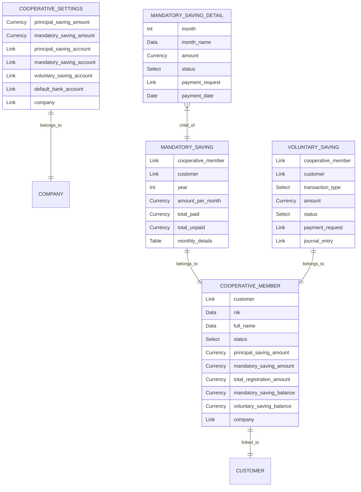
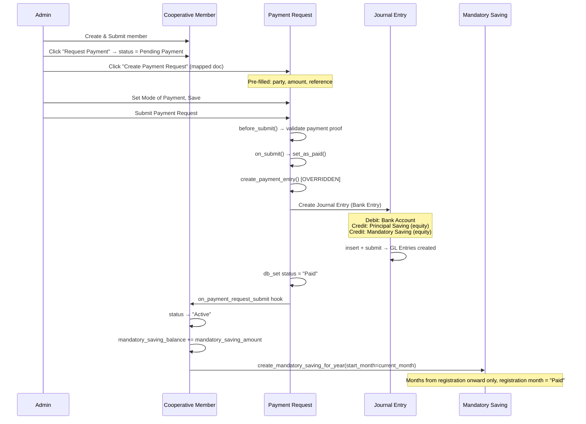
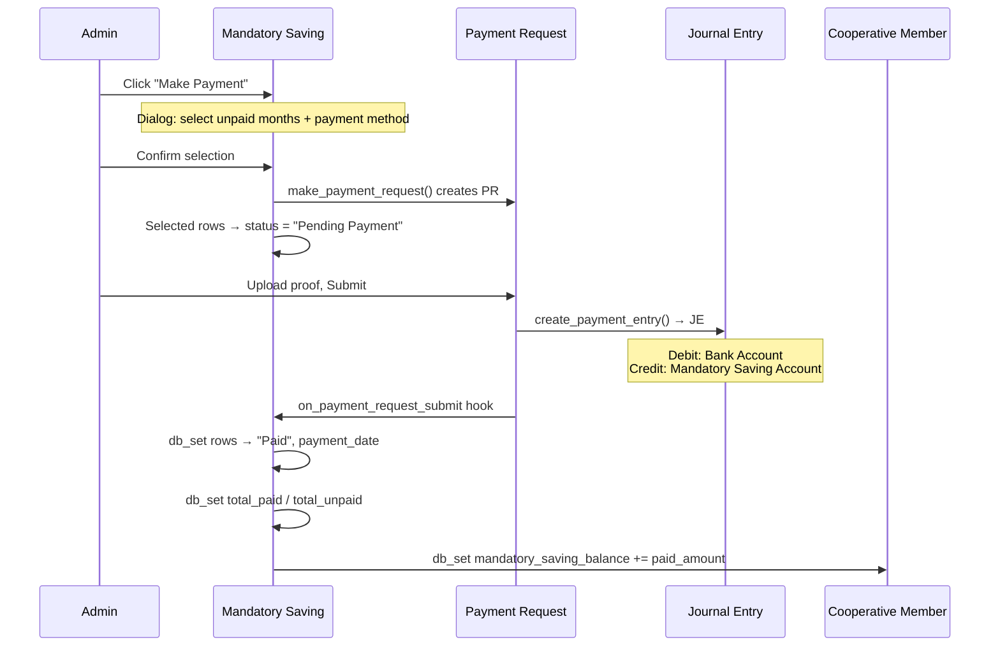
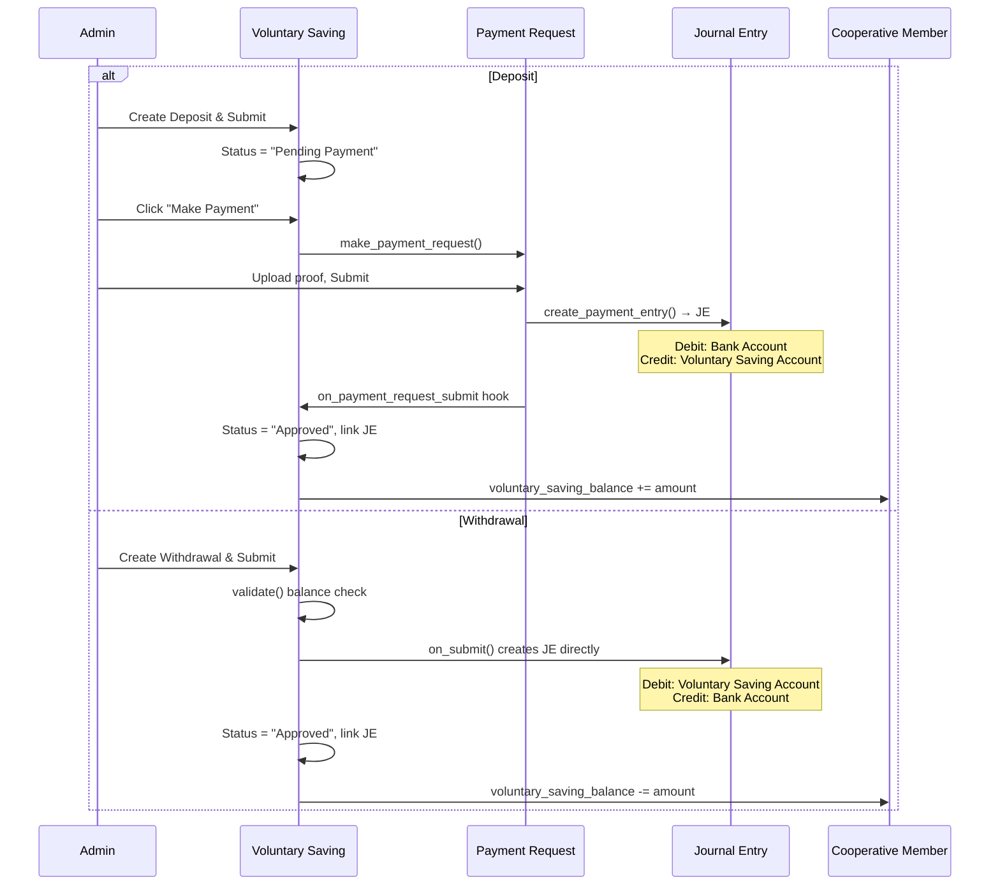

# Cooperative Savings Module — Architecture & Walkthrough

> Documentation for the Cooperative (Koperasi) Savings module built on the Webshop app.  
> Last updated: 2026-02-22

---

## 1. Overview

The Cooperative Savings module manages member registration, savings collection, and accounting journal entries for a cooperative (koperasi). It integrates with ERPNext's accounting system via **Journal Entries** — deliberately bypassing the Payment Entry module to avoid its strict validations against custom doctypes.

### Key Design Decision

> ERPNext's `Payment Entry` module hardcodes validations for standard doctypes (Sales Invoice, Sales Order, etc.) and rejects custom references. After extensive research, we chose **direct Journal Entry creation** as the only sustainable approach.

---

## 2. DocType Architecture



### 2.1 Cooperative Settings (Single)

Central configuration. All amounts and accounts are sourced from here.

| Field | Type | Purpose |
|---|---|---|
| `principal_saving_amount` | Currency | Default registration principal (Simpanan Pokok), default: 250,000 |
| `mandatory_saving_amount` | Currency | Monthly mandatory saving (Simpanan Wajib), default: 50,000 |
| `principal_saving_account` | Link → Account | Equity account for principal savings |
| `mandatory_saving_account` | Link → Account | Equity account for mandatory savings |
| `voluntary_saving_account` | Link → Account | Equity account for voluntary savings |
| `default_bank_account` | Link → Account | Fallback bank/cash account for JE debit |
| `company` | Link → Company | Default company |

### 2.2 Cooperative Member (Submittable)

Member registration with personal data, KTP address, emergency contact, and auto-populated saving amounts.

**Key fields:** `customer`, `nik`, `full_name`, `status`, `principal_saving_amount`, `mandatory_saving_amount`, `total_registration_amount`, `mandatory_saving_balance`, `voluntary_saving_balance`, `company`, `company_currency`

**Balance fields:**

| Field | Type | Purpose |
|---|---|---|
| `mandatory_saving_balance` | Currency | Running total of all paid mandatory savings (updated automatically on payment) |
| `voluntary_saving_balance` | Currency | Running total of voluntary savings net balance: deposits − withdrawals (updated on payment) |

> Both fields are read-only, `allow_on_submit`, and maintained by the `on_payment_request_submit()` hook in `cooperative_payment.py`.

**Dashboard links:** Payment Request (Payment group), Mandatory Saving, Voluntary Saving (Saving group)

**Status flow:** `Draft` → `Pending Payment` → `Active` (or `Rejected`)

**Naming:** `COOP-.YYYY.-.#####`

**Client-side buttons (Active members):**
- **Create Next Year Saving** — manually creates Mandatory Saving for the next year

### 2.3 Mandatory Saving (Submittable)

Tracks 12-month mandatory savings per member per year.

**Naming:** `{cooperative_member}-{year}` (e.g. `COOP-2026-00001-2026`)

**Key fields:** `cooperative_member`, `year`, `amount_per_month`, `monthly_details` (child table of 12 rows)

### 2.4 Mandatory Saving Detail (Child Table)

Each row = one month. Fields: `month`, `month_name`, `amount`, `status` (Unpaid/Pending Payment/Paid), `payment_request`, `payment_date`

### 2.5 Voluntary Saving (Submittable)

Ad-hoc deposits or withdrawals.

**Naming:** `VOL-SAV-.YYYY.-.#####`

**Key fields:** `cooperative_member`, `transaction_type` (Deposit/Withdrawal), `amount`, `status`, `payment_request`, `journal_entry`

---

## 3. Registration & Payment Flow



### 3.1 Bank Account Resolution

The debit account in the Journal Entry is determined by this priority:

1. **Mode of Payment Account** — looks up `Mode of Payment Account` child table where `parent = mode_of_payment` and `company = company`
2. **Cooperative Settings** — `default_bank_account` as fallback
3. **Error** — throws if neither is set

### 3.2 Journal Entry Structure (Registration)

| Row | Account | Debit | Credit |
|---|---|---|---|
| 1 | Bank Account (from Mode of Payment / Settings) | `total_registration_amount` | 0 |
| 2 | Principal Saving Account (equity) | 0 | `principal_saving_amount` |
| 3 | Mandatory Saving Account (equity) | 0 | `mandatory_saving_amount` |

**Total Debit = Total Credit = `total_registration_amount`** (= principal + mandatory)

### 3.3 Mandatory Saving — Monthly Payment Flow

The Mandatory Saving "Make Payment" button allows admins to pay unpaid months:



> [!IMPORTANT]
> All updates to submitted documents (Mandatory Saving, Cooperative Member) use `frappe.db.set_value()` instead of `doc.save()`. This bypasses Frappe's `_validate_update_after_submit` mechanism which silently drops field changes on submitted documents, even with `allow_on_submit = 1`.

### 3.4 Journal Entry Structure (Mandatory Saving Payment)

| Row | Account | Debit | Credit |
|---|---|---|---|
| 1 | Bank Account (from Mode of Payment / Settings) | `total of selected months` | 0 |
| 2 | Mandatory Saving Account (equity) | 0 | `total of selected months` |

### 3.5 Voluntary Saving Flow

Voluntary Savings handle both Deposits (money coming in, via Payment Request) and Withdrawals (money going out, via direct Journal Entry).



---

## 4. File Map

### Core DocTypes

| File | Purpose |
|---|---|
| `webshop/doctype/cooperative_settings/cooperative_settings.json` | Settings schema |
| `webshop/doctype/cooperative_member/cooperative_member.json` | Member schema (includes balance fields + dashboard links) |
| `webshop/doctype/cooperative_member/cooperative_member.py` | Member python logic + `make_payment_request()` mapper |
| `webshop/doctype/cooperative_member/cooperative_member.js` | Client-side buttons (Create/View Payment Request, Create Next Year Saving) |
| `webshop/doctype/mandatory_saving/mandatory_saving.json` | Mandatory Saving schema |
| `webshop/doctype/mandatory_saving/mandatory_saving.py` | Mandatory Saving logic + `make_payment_request()` API |
| `webshop/doctype/mandatory_saving/mandatory_saving.js` | Client-side "Make Payment" button with unpaid month selector |
| `webshop/doctype/mandatory_saving_detail/mandatory_saving_detail.json` | Monthly detail child table |
| `webshop/doctype/voluntary_saving/voluntary_saving.json` | Voluntary Saving schema |

### Override & API

| File | Purpose |
|---|---|
| `webshop/doctype/override_doctype/payment_request.py` | **Core override** — `create_payment_entry()` creates JE instead of PE |
| `webshop/api/cooperative_payment.py` | API: registration PR, `on_payment_request_submit()` hook (balance updates via `db_set`), `create_mandatory_saving_for_year()`, `create_annual_mandatory_savings()`, `create_next_year_saving()` |
| `webshop/api/backfill_saving_balance.py` | One-time script to backfill `mandatory_saving_balance` for existing members |

### Hooks (`hooks.py`)

```python
# Class override — Payment Request uses our custom class
override_doctype_class = {
    "Payment Request": "webshop.webshop.doctype.override_doctype.payment_request.PaymentRequest",
}

# Doc event — fires after PR submit to activate member / update savings
doc_events = {
    "Payment Request": {
        "on_submit": [
            "webshop.webshop.api.cooperative_payment.on_payment_request_submit"
        ]
    },
}

# Scheduled job — auto-create Mandatory Saving for all active members on Jan 1st
scheduler_events = {
    "cron": {
        "0 0 1 1 *": [
            "webshop.webshop.api.cooperative_payment.create_annual_mandatory_savings"
        ]
    }
}
```

---

## 5. What Still Needs Implementation

### ~~Mandatory Saving — Monthly Payment Flow~~ ✅ Done

- [x] "Make Payment" button on Mandatory Saving form for unpaid months
- [x] `create_payment_entry()` handles `reference_doctype == "Mandatory Saving"` → JE: Debit Bank ↔ Credit Mandatory Saving Account
- [x] After payment, update the corresponding `monthly_details` row to "Paid" and set `payment_date`
- [x] Recalculate `total_paid` / `total_unpaid` on the parent (via `db_set`)
- [x] Update `mandatory_saving_balance` on Cooperative Member (via `db_set`)

### ~~Annual Rollover~~ ✅ Done

- [x] Scheduled job (`0 0 1 1 *`) auto-creates current year’s Mandatory Saving for all active members
- [x] Manual "Create Next Year Saving" button on Cooperative Member form

### ~~Dashboard~~ ✅ Done

- [x] Payment Request linked on Cooperative Member dashboard (Payment group)

### ~~Voluntary Saving — Deposit & Withdrawal~~ ✅ Done

The `Voluntary Saving` DocType supports member-led deposits and withdrawals:

- **Deposit flow**: Admin creates VS (Deposit) → Submits (becomes "Pending Payment") → Clicks "Make Payment" to create Payment Request → PR is Paid → JE is automatically created (Debit Bank ↔ Credit Voluntary Saving Account) → VS status = "Approved" → `voluntary_saving_balance` increases.
- **Withdrawal flow**: Admin creates VS (Withdrawal) → Submits → Backend validates balance → Creates JE instantly (Debit Voluntary Saving ↔ Credit Bank) → VS status = "Approved" → `voluntary_saving_balance` decreases.
- Link `journal_entry` field is updated with the created Journal Entry in both cases.

### Other Enhancements

- [ ] Dashboard / report for cooperative financials
- [ ] Member-facing portal (webshop frontend) for self-service
- [ ] WhatsApp notification on payment confirmation
