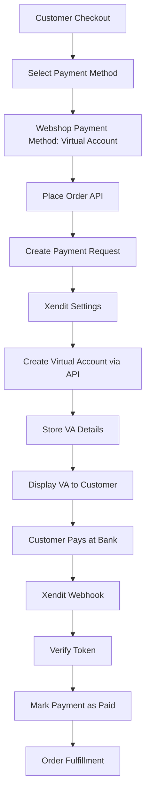
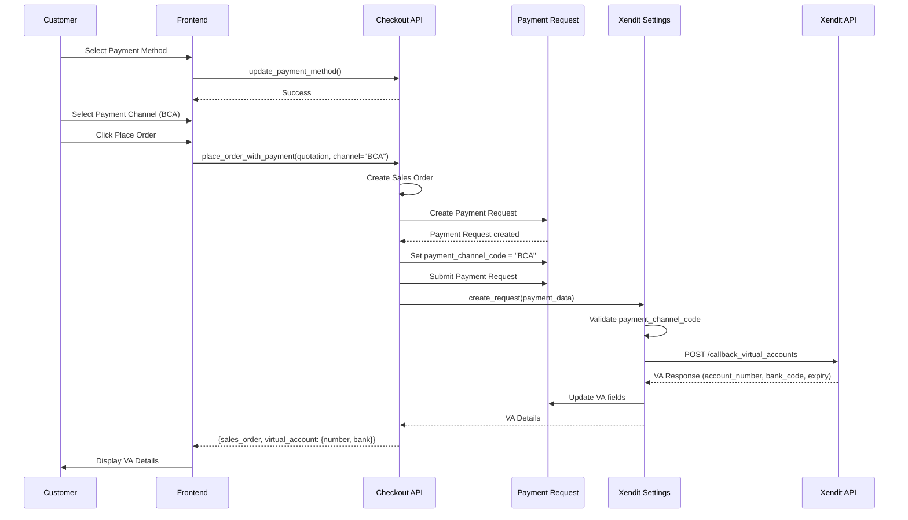
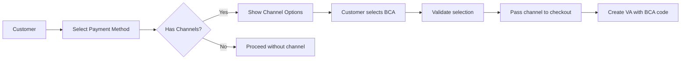

# Xendit Payment Gateway Integration Documentation

## Overview

This document provides comprehensive documentation for the Xendit payment gateway integration in the webshop application. Xendit is integrated using the Virtual Account payment method, allowing customers to pay through bank transfers using dynamically generated virtual account numbers.

## Table of Contents

- [Architecture Overview](#architecture-overview)
- [Components](#components)
- [Setup and Configuration](#setup-and-configuration)
- [Checkout Flow](#checkout-flow)
- [Webhook Implementation](#webhook-implementation)
- [Payment Method Integration](#payment-method-integration)
- [Frontend Components](#frontend-components)
- [API Reference](#api-reference)
- [Testing](#testing)
- [Troubleshooting](#troubleshooting)

## Architecture Overview

The Xendit integration follows a modular architecture that integrates with the existing Payment Gateway framework in ERPNext and the webshop's dynamic payment method system.



### Key Components

1. **Xendit Settings** - Single doctype for Xendit configuration
2. **Payment Request** - Extended with Xendit-specific custom fields
3. **Webshop Payment Method** - Contains payment channels for different banks
4. **Webshop Payment Channel** - Child table for bank-specific VA options
5. **Checkout API** - Handles order placement and payment request creation
6. **Webhook Handler** - Processes payment notifications from Xendit
7. **Frontend Components** - Displays VA details and payment instructions

## Components

### 1. Xendit Settings DocType

**Location:** `webshop/webshop/doctype/xendit_settings/`

**File:** `xendit_settings.json`

#### Fields

| Field            | Type     | Description                       |
| ---------------- | -------- | --------------------------------- |
| `enabled`        | Check    | Enable/disable Xendit integration |
| `test_mode`      | Check    | Use test API credentials          |
| `secret_api_key` | Password | Xendit API key for authentication |
| `webhook_token`  | Data     | Token for webhook verification    |

#### Key Methods

**`get_api_key()`**

```python
def get_api_key(self):
    if self.test_mode:
        return self.get_password("secret_api_key")
    return self.get_password("secret_api_key")
```

Returns the appropriate API key based on test/production mode.

**`create_payment_request(payment_request)`**

```python
def create_payment_request(self, payment_request):
    """Create a Virtual Account via Xendit API."""
```

- Validates payment request has `payment_channel_code`
- Encodes API key for Basic authentication
- Creates payload with external_id, bank_code, name, expected_amount, expiration_date
- Calls Xendit API: `POST https://api.xendit.co/callback_virtual_accounts`
- Stores VA details in Payment Request custom fields
- Creates Integration Request log for audit trail

**API Request Format:**

```python
payload = {
    "external_id": payment_request.name,
    "bank_code": payment_request.payment_channel_code,  # e.g., "BCA", "MANDIRI"
    "name": payment_request.party_name or "Customer",
    "is_closed": True,
    "expected_amount": payment_request.grand_total,
    "expiration_date": expiration_date.isoformat()
}

headers = {
    "Authorization": f"Basic {encoded_api_key}",
    "Content-Type": "application/json"
}
```

**API Response Handling:**

```python
response_data = {
    "external_id": "PR-xxxx",
    "account_number": "88000123456",
    "bank_code": "BCA",
    "expiration_date": "2025-12-31T23:59:59.000Z",
    "status": "PENDING"
}

# Updates to Payment Request
payment_request.db_set("virtual_account_number", response_data.get("account_number"))
payment_request.db_set("virtual_account_bank", response_data.get("bank_code"))
payment_request.db_set("payment_due_date", expiry_date)
payment_request.db_set("status", "Requested")
```

**Error Handling:**

- Creates Integration Request with status "Failed"
- Logs complete error details including request, response, and traceback
- Throws user-friendly error message

### 2. Payment Request Custom Fields

**Location:** `webshop/patches/add_xendit_fields_to_payment_request.py`

#### Fields Added

| Field                    | Type | Description                        |
| ------------------------ | ---- | ---------------------------------- |
| `payment_channel_code`   | Data | Bank code (e.g., "BCA", "MANDIRI") |
| `virtual_account_number` | Data | Generated VA number                |
| `virtual_account_bank`   | Data | Bank name for the VA               |

These fields are created as custom fields on the standard ERPNext Payment Request doctype.

### 3. Webshop Payment Channel DocType

**Location:** `webshop/webshop/doctype/webshop_payment_channel/`

**Purpose:** Child table for Webshop Payment Method to store available bank channels.

#### Fields

| Field          | Type         | Description                                |
| -------------- | ------------ | ------------------------------------------ |
| `channel_name` | Data         | Display name (e.g., "BCA Virtual Account") |
| `channel_code` | Data         | API code (e.g., "BCA")                     |
| `icon`         | Attach Image | Bank logo                                  |
| `description`  | Small Text   | Channel description                        |

**Usage Example:**

```json
{
  "channel_name": "BCA Virtual Account",
  "channel_code": "BCA",
  "description": "Pay via BCA Virtual Account",
  "icon": "/files/bca-logo.png"
}
```

### 4. Webshop Payment Method Integration

The Xendit integration extends the existing Webshop Payment Method system (see [PAYMENT_METHOD_DOCUMENTATION.md](PAYMENT_METHOD_DOCUMENTATION.md)).

**Configuration Example:**

```
Payment Method Name: Virtual Account
Title: Virtual Account
Payment Type: Payment Gateway
Payment Gateway Account: Xendit - IDR
Enabled: ✓

Payment Channels:
├─ BCA Virtual Account (BCA)
├─ Mandiri Virtual Account (MANDIRI)
├─ BRI Virtual Account (BRI)
└─ BNI Virtual Account (BNI)
```

## Setup and Configuration

### Step 1: Create Payment Gateway

1. Navigate to **Payment Gateway** list
2. Create new Payment Gateway:
   - Gateway: `Xendit`

### Step 2: Create Payment Gateway Account

1. Navigate to **Payment Gateway Account** list
2. Create new account:
   - Payment Gateway: `Xendit`
   - Payment Account: (Select appropriate GL account, e.g., "Cash - IDR")
   - Currency: `IDR`

### Step 3: Configure Xendit Settings

1. Navigate to **Xendit Settings** (search in awesome bar)
2. Configure:
   - **Enabled:** ✓
   - **Test Mode:** ✓ (for testing) or ✗ (for production)
   - **Secret API Key:** Your Xendit API key
     - Test: `xnd_development_...`
     - Production: `xnd_production_...`
   - **Webhook Verification Token:** Generate a secure random string

### Step 4: Configure Webhook URL in Xendit Dashboard

1. Log in to [Xendit Dashboard](https://dashboard.xendit.co/)
2. Navigate to Settings → Webhooks
3. Add callback URL:
   ```
   https://your-domain.com/api/method/webshop.webshop.doctype.xendit_settings.xendit_settings.handle_webhook
   ```
4. Set the verification token (same as configured in Step 3)
5. Enable "Fixed Virtual Account Paid" webhook

### Step 5: Create Webshop Payment Method

1. Navigate to **Webshop Payment Method** list
2. Create new payment method:

   - **Payment Method Name:** `Virtual Account`
   - **Title:** `Virtual Account`
   - **Description:** `Bayar dengan Virtual Account dari berbagai bank`
   - **Payment Type:** `Payment Gateway`
   - **Payment Gateway Account:** Select the Xendit account created in Step 2
   - **Enabled:** ✓
   - **Payment Duration:** `86400` (24 hours in seconds)

3. Add Payment Channels (in the Payment Channels child table):

| Channel Name            | Channel Code | Description              |
| ----------------------- | ------------ | ------------------------ |
| BCA Virtual Account     | BCA          | Transfer melalui BCA     |
| Mandiri Virtual Account | MANDIRI      | Transfer melalui Mandiri |
| BRI Virtual Account     | BRI          | Transfer melalui BRI     |
| BNI Virtual Account     | BNI          | Transfer melalui BNI     |

> **Note:** Channel codes must match Xendit's bank codes. Refer to [Xendit Documentation](https://developers.xendit.co/api-reference/) for complete list.

## Checkout Flow

### Flow Diagram



### Detailed Flow

#### 1. Payment Method Selection

**Frontend:**

```vue
<!-- PaymentMethodSelector.vue -->
<template>
  <div v-for="method in paymentMethods" :key="method.name">
    <div @click="selectMethod(method)">
      {{ method.label }}
    </div>

    <!-- If method has channels -->
    <div v-if="method.payment_channels">
      <div
        v-for="channel in method.payment_channels"
        :key="channel.channel_code"
      >
        <input
          type="radio"
          :value="channel.channel_code"
          v-model="selectedChannel"
        />
        {{ channel.channel_name }}
      </div>
    </div>
  </div>
</template>
```

**API Call:**

```typescript
await updatePaymentMethod(quotationName, paymentMethodName);
```

#### 2. Place Order with Payment Channel

**Frontend:**

```typescript
const result = await placeOrderWithPayment(quotationName, selectedChannel);
// result: {sales_order, payment_url, redirect_type, virtual_account}
```

**Backend:** `checkout.py`

```python
@frappe.whitelist()
def place_order_with_payment(quotation_name, payment_channel=None):
    # 1. Validate quotation
    quotation = frappe.get_doc("Quotation", quotation_name)

    # 2. Create Sales Order
    sales_order_name = place_order(quotation_name=quotation_name)
    sales_order = frappe.get_doc("Sales Order", sales_order_name)

    # 3. Get payment details
    payment_data = get_payment_gateway_url(
        sales_order_name,
        payment_method_type,
        payment_channel
    )

    return {
        "sales_order": sales_order_name,
        "payment_url": payment_data.get("payment_url"),
        "redirect_type": payment_data.get("redirect_type"),
        "virtual_account": payment_data.get("virtual_account")
    }
```

#### 3. Payment Request Creation

**Location:** `checkout.py` → `get_payment_gateway_url()`

```python
def get_payment_gateway_url(sales_order_name, payment_method_type, payment_channel=None):
    payment_method = frappe.get_doc("Webshop Payment Method", payment_method_type)

    if payment_method.payment_type == "Payment Gateway":
        # Create Payment Request
        payment_request = frappe.new_doc("Payment Request")
        payment_request.payment_gateway_account = payment_method.payment_gateway_account
        payment_request.reference_doctype = "Sales Order"
        payment_request.reference_name = sales_order_name
        payment_request.grand_total = sales_order.grand_total

        # Set payment channel
        if payment_channel:
            payment_request.payment_channel_code = payment_channel

        payment_request.insert(ignore_permissions=True)
        payment_request.submit()

        # Create Xendit Virtual Account
        if payment_channel and xendit_settings.enabled:
            result = xendit_settings.create_request(payment_data)

            return {
                "payment_url": f"/order/{sales_order_name}/checkout",
                "redirect_type": "virtual_account",
                "virtual_account": {
                    "account_number": xendit_settings.virtual_account_number,
                    "bank_code": xendit_settings.virtual_account_bank
                }
            }
```

#### 4. Virtual Account Creation

**Location:** `xendit_settings.py` → `create_payment_request()`

This method:

1. Validates payment_channel_code is present
2. Encodes API key for Basic authentication
3. Prepares payload with external_id, bank_code, expected_amount, expiration_date
4. Calls Xendit API
5. Updates Payment Request with VA details
6. Creates Integration Request log

See [Xendit Settings](#1-xendit-settings-doctype) section for detailed implementation.

#### 5. Display Virtual Account

**Frontend:** `CheckoutPaymentPage.vue`

```vue
<VirtualAccountView
  v-if="paymentDetails.virtual_account && paymentDetails.virtual_account.number"
  :payment-details="paymentDetails"
/>
```

**Component:** `VirtualAccountView.vue`

Displays:

- VA Number with copy button
- Bank name
- Total amount
- Expiration date
- Payment instructions (ATM, Mobile Banking)

## Webhook Implementation

### Webhook Handler

**Location:** `xendit_settings.py`

**Endpoint:**

```
POST /api/method/webshop.webshop.doctype.xendit_settings.xendit_settings.handle_webhook
```

**Function:**

```python
@frappe.whitelist(allow_guest=True)
def handle_webhook():
    """Handle Xendit Webhooks."""
    data = frappe.request.get_json()

    # 1. Validate webhook token
    settings = frappe.get_doc("Xendit Settings")
    token = settings.webhook_token
    request_token = frappe.request.headers.get("x-callback-token")

    if token and request_token != token:
        frappe.throw(_("Invalid Webhook Token"), frappe.PermissionError)

    # 2. Extract payment data
    external_id = data.get("external_id")  # Payment Request name
    status = data.get("status")

    # 3. Get Payment Request
    payment_request = frappe.get_doc("Payment Request", external_id)

    # 4. Verify Payment Request is submitted
    if payment_request.docstatus != 1:
        return {"status": "error", "message": "Payment Request not submitted"}

    # 5. Check if already paid
    if payment_request.status == "Paid":
        return {"status": "already_processed"}

    # 6. Mark as paid if completed
    if status == "COMPLETED" or data.get("payment_id"):
        frappe.set_user("xendit_integration@system.local")
        payment_request.run_method("set_as_paid")
        return {"status": "success"}

    return {"status": "ignored"}
```

### Webhook Payload Examples

**Fixed Virtual Account Paid:**

```json
{
  "id": "64baa3e3e6e2e51234567890",
  "external_id": "PR-SO-00001-2025",
  "account_number": "88000123456",
  "bank_code": "BCA",
  "amount": 150000,
  "transaction_timestamp": "2025-01-16T10:30:00.000Z",
  "status": "COMPLETED",
  "payment_id": "payment_id_123"
}
```

### Webhook Security

1. **Token Verification:** Validates `x-callback-token` header against configured token
2. **HTTPS Only:** Webhook URL should use HTTPS in production
3. **IP Whitelisting:** (Optional) Configure firewall to allow Xendit IPs only
4. **System User:** Webhook executes as `xendit_integration@system.local` user

### Webhook Testing

**Using Xendit Dashboard:**

1. Navigate to Webhooks section
2. Use "Send Test Webhook" feature
3. Monitor Integration Request logs in ERPNext

**Manual Testing:**

```bash
curl -X POST https://your-domain.com/api/method/webshop.webshop.doctype.xendit_settings.xendit_settings.handle_webhook \
  -H "Content-Type: application/json" \
  -H "x-callback-token: your_secret_token" \
  -d '{
    "external_id": "PR-SO-00001-2025",
    "status": "COMPLETED",
    "payment_id": "payment_123456",
    "amount": 150000
  }'
```

## Payment Method Integration

### Integration with Webshop Payment Method

Xendit integrates with the existing Webshop Payment Method system, utilizing the Payment Gateway type with payment channels.

**Key Integration Points:**

1. **Payment Type:** `Payment Gateway`
2. **Payment Gateway Account:** Links to Xendit Payment Gateway Account
3. **Payment Channels:** Child table stores available bank options
4. **Payment Duration:** Configures VA expiration time

### Channel Selection Flow



**Frontend Validation:**

```typescript
// PaymentMethodSelector.vue
const isChannelRequired = computed(() => {
  if (!selectedMethod.value) return false;
  if (!selectedMethod.value.payment_channels?.length) return false;
  return true;
});

const isValid = computed(() => {
  if (!selectedMethod.value) return false;
  if (isChannelRequired.value && !selectedChannel.value) return false;
  return true;
});
```

**Backend Processing:**

```python
# checkout.py
if payment_channel:
    payment_request.payment_channel_code = payment_channel
```

## Frontend Components

### 1. CheckoutPaymentPage.vue

**Location:** `frontend/src/views/Checkout/CheckoutPaymentPage.vue`

**Purpose:** Main payment page that detects payment type and displays appropriate view.

**Key Logic:**

```vue
<template>
  <!-- Success View -->
  <PaymentSuccessView v-if="paymentDetails.payment_status === 'Paid'" />

  <!-- Bank Transfer View -->
  <BankTransferView
    v-else-if="paymentDetails.payment_method.payment_type === 'Transfer Manual'"
  />

  <!-- Virtual Account View -->
  <VirtualAccountView
    v-else-if="
      paymentDetails.virtual_account && paymentDetails.virtual_account.number
    "
  />
</template>
```

### 2. VirtualAccountView.vue

**Location:** `frontend/src/views/Checkout/components/VirtualAccountView.vue`

**Purpose:** Displays Virtual Account details and payment instructions.

**Features:**

- Displays VA number with copy-to-clipboard functionality
- Shows bank name, total amount, expiration date
- Provides expandable payment instructions for ATM and Mobile Banking
- Action buttons for "View Order" and "Continue Shopping"

**Key Sections:**

**VA Number Display:**

```vue
<div class="flex items-center gap-3 bg-gray-50 p-4 rounded-lg">
  <span class="text-2xl font-mono font-bold">
    {{ paymentDetails.virtual_account?.number }}
  </span>
  <button @click="copyToClipboard(...)">
    <!-- Copy Icon -->
  </button>
</div>
```

**Payment Instructions:**

```vue
<details class="group">
  <summary>ATM {{ paymentDetails.virtual_account?.bank }}</summary>
  <div>
    <ol>
      <li>Masukkan kartu ATM dan PIN Anda</li>
      <li>Pilih menu Transaksi Lainnya > Transfer > Virtual Account</li>
      <li>Masukkan nomor VA: {{ paymentDetails.virtual_account?.number }}</li>
      <li>Pastikan detail pembayaran sudah benar</li>
      <li>Ikuti instruksi untuk menyelesaikan pembayaran</li>
    </ol>
  </div>
</details>
```

### 3. PaymentMethodSelector.vue

**Location:** `frontend/src/views/Checkout/components/PaymentMethodSelector.vue`

**Purpose:** Allows customer to select payment method and channel.

**Channel Selection:**

```vue
<div v-if="method.payment_channels?.length">
  <div class="channels-grid">
    <label v-for="channel in method.payment_channels"
           :key="channel.channel_code"
           class="channel-option">
      <input
        type="radio"
        :value="channel.channel_code"
        v-model="selectedChannel"
      />
      
      <span>{{ channel.channel_name }}</span>
    </label>
  </div>

  <!-- Warning if channel required but not selected -->
  <div v-if="isChannelRequired && !selectedChannel" class="warning">
    Silakan pilih bank untuk melanjutkan
  </div>
</div>
```

## API Reference

### Checkout APIs

#### `place_order_with_payment(quotation_name, payment_channel=None)`

**Purpose:** Create Sales Order and initiate payment.

**Parameters:**

- `quotation_name` (str): Quotation document name
- `payment_channel` (str, optional): Bank code for VA (e.g., "BCA")

**Returns:**

```python
{
    "sales_order": "SO-00001",
    "payment_url": "/order/SO-00001/checkout",
    "redirect_type": "virtual_account",
    "virtual_account": {
        "account_number": "88000123456",
        "bank_code": "BCA"
    }
}
```

#### `get_checkout_payment_details(sales_order_name)`

**Purpose:** Get complete payment details for a Sales Order.

**Parameters:**

- `sales_order_name` (str): Sales Order document name

**Returns:**

```python
{
    "sales_order": {
        "name": "SO-00001",
        "grand_total": 150000,
        ...
    },
    "payment_method": {
        "name": "Virtual Account",
        "payment_type": "Payment Gateway",
        ...
    },
    "virtual_account": {
        "number": "88000123456",
        "bank": "BCA",
        "expiry": "2025-01-17T10:30:00"
    },
    "payment_status": "Requested"
}
```

### Xendit Settings APIs

#### `create_request(payment_data)`

**Purpose:** Create Virtual Account via Xendit API (internal method).

**Parameters:**

```python
payment_data = {
    "order_id": "PR-SO-00001-2025",
    "amount": 150000,
    "currency": "IDR",
    "bank_code": "BCA",
    "payment_channel_code": "BCA",
    "payer_name": "Customer Name",
    "payer_email": "customer@example.com"
}
```

**Returns:** Xendit API response with VA details.

#### `handle_webhook()`

**Purpose:** Handle Xendit webhook callbacks.

**Webhook Endpoint:**

```
POST /api/method/webshop.webshop.doctype.xendit_settings.xendit_settings.handle_webhook
```

**Headers:**

```
Content-Type: application/json
x-callback-token: <your_webhook_token>
```

**Payload:** See [Webhook Implementation](#webhook-implementation) section.

## Testing

### Unit Tests

**Location:** `webshop/tests/test_xendit.py`

**Test Class:** `TestXenditIntegration`

#### Test: Checkout with Xendit

```python
@patch('webshop.webshop.doctype.xendit_settings.xendit_settings.make_post_request')
def test_checkout_with_xendit(self, mock_make_post_request):
    """Test placing an order with a selected channel (BCA) and triggering Xendit VA creation."""

    # Mock Xendit API response
    mock_response_data = {
        "external_id": "PR-TEST-1",
        "bank_code": "BCA",
        "account_number": "88000123456",
        "expiration_date": "2025-12-31T23:59:59.000Z"
    }
    mock_make_post_request.return_value = mock_response_data

    # Create quotation with items
    quotation = frappe.get_doc({
        "doctype": "Quotation",
        "party_name": "Test Customer",
        "payment_method_type": "Virtual Account",
        "items": [{"item_code": "Test Item", "qty": 1, "rate": 50000}]
    })
    quotation.insert()

    # Place order with BCA channel
    result = place_order_with_payment(quotation.name, payment_channel="BCA")

    # Assertions
    self.assertEqual(result.get("redirect_type"), "virtual_account")
    self.assertEqual(result["virtual_account"]["account_number"], "88000123456")

    # Verify Payment Request
    pr = frappe.get_doc("Payment Request", {"reference_name": result["sales_order"]})
    self.assertEqual(pr.payment_channel_code, "BCA")
    self.assertEqual(pr.virtual_account_number, "88000123456")
```

#### Test: Xendit Webhook

```python
def test_xendit_webhook(self):
    """Test handling of Xendit webhook to mark Payment Request as Paid."""

    # Create submitted Payment Request
    pr = frappe.get_doc({
        "doctype": "Payment Request",
        "reference_doctype": "Sales Order",
        "reference_name": "SO-00001",
        "status": "Requested"
    })
    pr.insert()
    pr.submit()

    # Mock webhook payload
    frappe.request = MagicMock()
    frappe.request.get_json.return_value = {
        "external_id": pr.name,
        "status": "COMPLETED",
        "payment_id": "pay_123456"
    }
    frappe.request.headers = {"x-callback-token": "secret_token"}

    # Call webhook
    handle_webhook()

    # Verify payment marked as paid
    pr.reload()
    self.assertEqual(pr.status, "Paid")
```

### Manual Testing Checklist

- [ ] Create Xendit Settings with test API key
- [ ] Configure Payment Gateway Account
- [ ] Create Webshop Payment Method with channels
- [ ] Add product to cart
- [ ] Select Virtual Account payment method
- [ ] Select bank channel (e.g., BCA)
- [ ] Place order
- [ ] Verify VA number is displayed
- [ ] Verify VA details in Payment Request
- [ ] Test webhook by triggering payment in Xendit sandbox
- [ ] Verify order status changes to Paid
- [ ] Check Integration Request logs

### Test Data Cleanup

**Script:** `webshop/tests/cleanup_xendit_data.py`

Cleans up test data including:

- Payment Requests
- Sales Orders
- Quotations
- Addresses
- Customers
- Payment Gateway Accounts

## Troubleshooting

### Common Issues

#### 1. VA Creation Fails

**Symptoms:**

- Error message: "Failed to create Virtual Account"
- Integration Request shows "Failed" status

**Possible Causes:**

- Invalid API key
- payment_channel_code not set
- Insufficient Xendit account balance (for production)
- Invalid bank_code

**Solutions:**

1. Verify API key in Xendit Settings
2. Check Xendit Dashboard for API errors
3. Verify bank code in Payment Channel matches Xendit's codes
4. Check Integration Request log for detailed error

#### 2. Webhook Not Working

**Symptoms:**

- Payment not marked as paid after customer pays
- No Integration Request created for webhook

**Possible Causes:**

- Incorrect webhook URL
- Webhook token mismatch
- Firewall blocking Xendit IPs
- Payment Request not submitted (docstatus != 1)

**Solutions:**

1. Verify webhook URL in Xendit Dashboard
2. Check webhook token matches between Xendit and Settings
3. Verify Payment Request is submitted before payment
4. Test webhook manually using curl
5. Check Error Log for exceptions

#### 3. Channel Selection Not Working

**Symptoms:**

- Cannot select bank channel
- Channel selection not passed to backend

**Possible Causes:**

- Payment Method has no channels configured
- Frontend validation preventing submission

**Solutions:**

1. Verify Payment Channels are added to Payment Method
2. Check console for JavaScript errors
3. Verify `payment_channel_code` is being sent in API call

#### 4. VA Number Not Displayed

**Symptoms:**

- Checkout page doesn't show VA details
- Shows "Payment type not supported" message

**Possible Causes:**

- virtual_account fields not populated in Payment Request
- VA creation failed silently
- Frontend not receiving VA data

**Solutions:**

1. Check Payment Request for `virtual_account_number` field
2. Verify Integration Request status
3. Check browser console for API response
4. Verify `get_checkout_payment_details` returns VA data

### Debug Logging

**Enable debug logging in Xendit Settings:**

```python
# Add to create_payment_request method
frappe.log_error(
    f"Xendit Request: {json.dumps(payload, indent=2)}",
    "Xendit Debug"
)
frappe.log_error(
    f"Xendit Response: {json.dumps(response_data, indent=2)}",
    "Xendit Debug"
)
```

**Check logs in ERPNext:**

1. Navigate to Error Log list
2. Filter by title "Xendit"
3. Review request/response details

### Getting Help

**Resources:**

- [Xendit Documentation](https://developers.xendit.co/)
- [Xendit API Reference](https://developers.xendit.co/api-reference/)
- [ERPNext Payment Integration Guide](https://docs.erpnext.com/docs/user/manual/en/accounts/payment-gateway-integration)

**Support Channels:**

- Xendit Support: support@xendit.co
- Xendit Developer Slack: Join via Xendit Dashboard

## Conclusion

The Xendit integration provides a robust Virtual Account payment solution for the webshop, leveraging ERPNext's Payment Gateway framework and the webshop's dynamic payment method system. The modular architecture allows for easy extension to support additional banks and payment methods in the future.

### Key Advantages

1. **Seamless Integration:** Works with existing ERPNext Payment Request workflow
2. **Multi-Bank Support:** Easy to add new VA channels via Payment Channels
3. **Real-time Updates:** Webhook integration ensures instant payment confirmation
4. **Audit Trail:** Complete logging via Integration Request
5. **User-Friendly:** Clear VA display with payment instructions
6. **Secure:** Token-based webhook verification

### Future Enhancements

- Support for additional Xendit payment methods (E-Wallet, Credit Card)
- Automated bank reconciliation
- Customer payment history dashboard
- Multiple Xendit accounts for different currencies
- Advanced error recovery mechanisms
