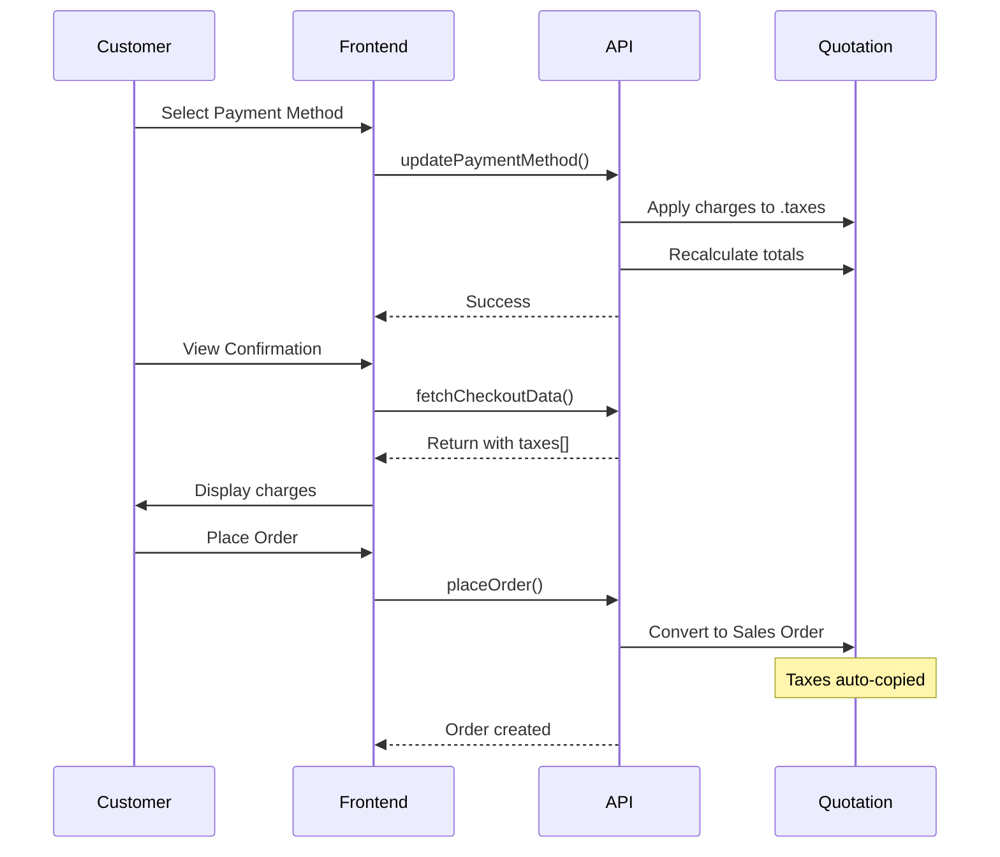

# Payment Method Service Fees

Complete guide to configuring and using service fees for payment methods in the webshop.

---

## Overview

The service fee feature allows administrators to configure additional charges (percentage-based or fixed amount) for specific payment methods. These charges are automatically applied to customer orders when a payment method is selected during checkout.

### Key Features

- **Flexible Charge Types**: Percentage-based or fixed amount charges
- **Multiple Charges**: Configure multiple charges per payment method
- **Automatic Application**: Charges applied automatically when payment method selected
- **Transparent**: Customers see all charges before placing order
- **ERPNext Compatible**: Uses standard Sales Taxes and Charges doctype

---

## Quick Start

### 1. Configure Payment Method Charges

1. Navigate to **Webshop > Webshop Payment Method**
2. Select or create a payment method
3. Scroll to **Payment Charges** section
4. Click **Add Row** to add a charge

**Example - 2% Gateway Fee**:

- Charge Type: `On Net Total`
- Description: `Payment Gateway Fee`
- Rate: `2.0`
- Account Head: `Service Charges - Company`
- Cost Center: `Main - Company`

**Example - Fixed Admin Fee**:

- Charge Type: `Actual`
- Description: `Admin Fee`
- Tax Amount: `5000`
- Account Head: `Service Charges - Company`
- Cost Center: `Main - Company`

### 2. How It Works

1. Customer selects payment method during checkout
2. System automatically adds configured charges to quotation
3. Order total updated to include service charges
4. Charges displayed in order confirmation
5. Sales Order created with charges included

---

## Configuration Details

### Charge Types

#### On Net Total (Percentage-based)

Calculates charge as a percentage of the order subtotal.

**Fields**:

- **Rate**: Percentage value (e.g., `2.0` for 2%)
- **Tax Amount**: Leave empty (calculated automatically)

**Example**: 2% fee on ₹100,000 order = ₹2,000

#### Actual (Fixed Amount)

Applies a fixed charge amount regardless of order total.

**Fields**:

- **Rate**: Leave empty
- **Tax Amount**: Fixed amount (e.g., `5000`)

**Example**: ₹5,000 fee on any order

### Required Fields

All charges must have:

- **Description**: Display name shown to customers
- **Account Head**: GL account for posting charges
- **Cost Center**: Cost center for accounting allocation

### Accounting Setup

Create GL accounts for service charges:

```
Chart of Accounts
└── Income
    └── Service Charges - [Company]
```

Or use existing accounts like:

- Payment Gateway Charges
- Transaction Fees
- Admin Fees

---

## User Experience

### Checkout Flow

```
Step 1: Cart Review
  ↓
Step 2: Select Payment Method
  → Service charges automatically applied
  ↓
Step 3: Order Confirmation
  → Charges displayed as line items
  → Grand total shown
  ↓
Place Order
  → Sales Order created with charges
```

### What Customers See

**Order Confirmation Display**:

```
Metode Pembayaran: Credit Card
━━━━━━━━━━━━━━━━━━━━━━━━━━━
Payment Gateway Fee        ₹2,000
Admin Fee                  ₹5,000
━━━━━━━━━━━━━━━━━━━━━━━━━━━
Total Pembayaran    ₹107,000
```

---

## Technical Implementation

### Backend Components

#### 1. Webshop Payment Method Doctype

**Location**: `webshop/webshop/doctype/webshop_payment_method/`

**Key Field**:

- `payment_charges` (Table): Links to Sales Taxes and Charges

**Method**:

```python
@frappe.whitelist()
def get_payment_method_charges(payment_method_name):
    """Retrieve charge configuration"""
```

#### 2. Checkout API

**File**: `webshop/webshop/api/checkout.py`

**Key Functions**:

**get_checkout_data()**: Returns quotation with taxes

```python
{
    "quotation_name": "QTN-00001",
    "total": 107000,
    "taxes": [
        {
            "charge_type": "On Net Total",
            "description": "Payment Gateway Fee",
            "tax_amount": 2000
        }
    ]
}
```

**update_payment_method()**: Applies charges when method selected

```python
def update_payment_method(quotation_name, payment_method_type):
    # Update payment method
    # Apply service charges
    # Recalculate totals
```

**Helper Function**:

```python
def _apply_service_charges_to_quotation(quotation, payment_method_name):
    """
    1. Clear existing service charges
    2. Get charges from payment method
    3. Add to quotation.taxes
    4. Recalculate totals
    """
```

#### 3. Client-Side Overrides

**Files**:

- `webshop/public/js/quotation.js`
- `webshop/public/js/sales_order.js`

**Purpose**: Auto-apply charges when manually editing in ERPNext UI

### Frontend Components

#### 1. Type Definitions

**File**: `frontend/src/types/checkout.ts`

```typescript
export interface TaxCharge {
  charge_type: string;
  description: string;
  rate?: number;
  tax_amount?: number;
}

export interface CheckoutData {
  taxes?: TaxCharge[]; // Service charges
  // ... other fields
}
```

#### 2. Checkout Store

**File**: `frontend/src/stores/checkout.ts`

```typescript
// Computed property - gets charges from quotation
const serviceCharges = computed(() => checkoutData.value?.taxes || []);

// Update payment method
async function setPaymentMethod(type: string) {
  await updatePaymentMethod(quotationName.value, type);
  // Backend automatically applies charges
}
```

#### 3. UI Component

**File**: `frontend/src/views/Checkout/components/OrderConfirmation.vue`

Displays service charges in order confirmation before checkout.

---

## Data Flow

### Complete Process



### Step-by-Step

1. **Initialization**: Customer adds items to cart
2. **Method Selection**: Customer chooses payment method
3. **Charge Application**: System adds charges to quotation automatically
4. **Data Refresh**: Frontend fetches updated quotation with charges
5. **Display**: Charges shown in order confirmation
6. **Order Creation**: Sales Order created with charges included

---

## Testing

### Manual Test Steps

1. **Setup**:

   - Configure payment method with charges
   - Add items to cart

2. **Checkout**:

   - Go to checkout
   - Select payment method with charges
   - Verify charges appear in confirmation
   - Check grand total is correct

3. **Order Placement**:

   - Place order
   - Verify Sales Order has charges in Taxes table
   - Check grand total matches

4. **Accounting**:
   - Submit Sales Order
   - Review GL entries
   - Verify charges posted to correct account

### Test Scenarios

#### Percentage Charge

- Order Total: ₹100,000
- Rate: 2%
- Expected Charge: ₹2,000
- Expected Grand Total: ₹102,000

#### Fixed Charge

- Order Total: ₹100,000
- Tax Amount: ₹5,000
- Expected Grand Total: ₹105,000

#### Combined Charges

- Order Total: ₹100,000
- Percentage (2%): ₹2,000
- Fixed: ₹5,000
- Expected Grand Total: ₹107,000

### Unit Tests

**Run Tests**:

```bash
bench --site [site-name] run-tests webshop.tests.test_service_charges
bench --site [site-name] run-tests webshop.webshop.doctype.webshop_payment_method.test_webshop_payment_method
```

**Test Coverage**:

- ✅ Percentage calculation
- ✅ Fixed amount
- ✅ Combined charges
- ✅ No charges configured
- ✅ Invalid payment method

---

## Troubleshooting

### Common Issues

#### Charges Not Appearing

**Problem**: Service charges not showing in checkout

**Checklist**:

- [ ] Payment method has charges configured
- [ ] Charges have all required fields (account_head, cost_center)
- [ ] Payment method is enabled
- [ ] `quotation.payment_method_type` is set

**Debug**: Check browser console for API errors

#### Wrong Total

**Problem**: Grand total doesn't match expected value

**Possible Causes**:

- Frontend not refreshing after payment method selection
- Multiple charges being applied

**Solution**:

- Verify `fetchCheckoutData()` called when navigating to confirmation
- Check `quotation.taxes` table for duplicate entries

#### Validation Errors

**Problem**: Error when saving quotation/order

**Common Causes**:

- Missing account_head
- Missing cost_center
- Invalid GL account

**Solution**: Ensure all charges have valid account_head and cost_center

### Debug Mode

Enable detailed logging in `checkout.py`:

```python
frappe.log_error(
    f"Applied charges to {quotation.name}: {quotation.taxes}",
    "Service Charges Debug"
)
```

View logs in: **Error Log** doctype

---

## Best Practices

### Configuration

1. **Use Descriptive Names**: Make charge descriptions clear to customers
2. **Set Appropriate Rates**: Consider market standards for fees
3. **Configure Accounts**: Use proper GL accounts for accurate reporting
4. **Test Thoroughly**: Test with different order amounts

### Accounting

1. **Separate Accounts**: Use dedicated accounts for service charges
2. **Cost Center Allocation**: Assign appropriate cost centers
3. **Regular Reconciliation**: Verify charge postings monthly

### User Experience

1. **Transparency**: Always show charges before order placement
2. **Clear Descriptions**: Use customer-friendly language
3. **Competitive Rates**: Keep charges reasonable

---

## API Reference

### get_checkout_data()

**Endpoint**: `/api/method/webshop.webshop.api.checkout.get_checkout_data`

**Method**: POST

**Parameters**:

- `student_name` (optional): Student for quotation

**Response**:

```json
{
  "quotation_name": "QTN-00001",
  "items": [...],
  "total": 107000,
  "taxes": [
    {
      "charge_type": "On Net Total",
      "description": "Payment Gateway Fee",
      "rate": 2.0,
      "tax_amount": 2000,
      "account_head": "Service Charges - C",
      "cost_center": "Main - C"
    }
  ]
}
```

### update_payment_method()

**Endpoint**: `/api/method/webshop.webshop.api.checkout.update_payment_method`

**Method**: POST

**Parameters**:

- `quotation_name`: Quotation ID
- `payment_method_type`: Payment method name

**Response**:

```json
{
  "success": true,
  "message": "Payment method updated successfully",
  "quotation_name": "QTN-00001"
}
```

---

## FAQ

### Q: Can I have different charges for different payment methods?

**A**: Yes! Each payment method can have its own charge configuration.

### Q: Can charges be conditional based on order amount?

**A**: Not currently. Charges apply to all orders regardless of amount. You can implement custom logic if needed.

### Q: What happens if I change payment method?

**A**: Old charges are removed and new charges (if any) are applied automatically.

### Q: Are charges refundable if order is cancelled?

**A**: Follows standard ERPNext refund process. Service charges are part of the order and would be included in refund calculations.

### Q: Can customers see charges before selecting payment method?

**A**: Charges are displayed after payment method selection in the order confirmation step.

### Q: How do I disable charges for a payment method?

**A**: Remove all rows from the Payment Charges table in the payment method configuration.

---

## Changelog

### Version 1.0 (January 2026)

**Initial Release**:

- Payment method charge configuration
- Automatic application to quotations
- Frontend display in checkout
- ERPNext Sales Taxes and Charges integration
- Unit test coverage
- Documentation

---

## Support

For issues or questions:

1. Check this documentation
2. Review error logs in ERPNext
3. Run unit tests to verify configuration
4. Contact system administrator

---

**Last Updated**: January 2026  
**Version**: 1.0
